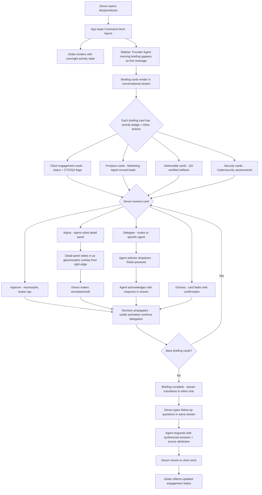
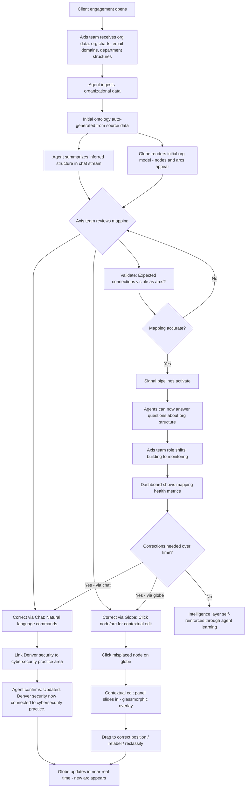
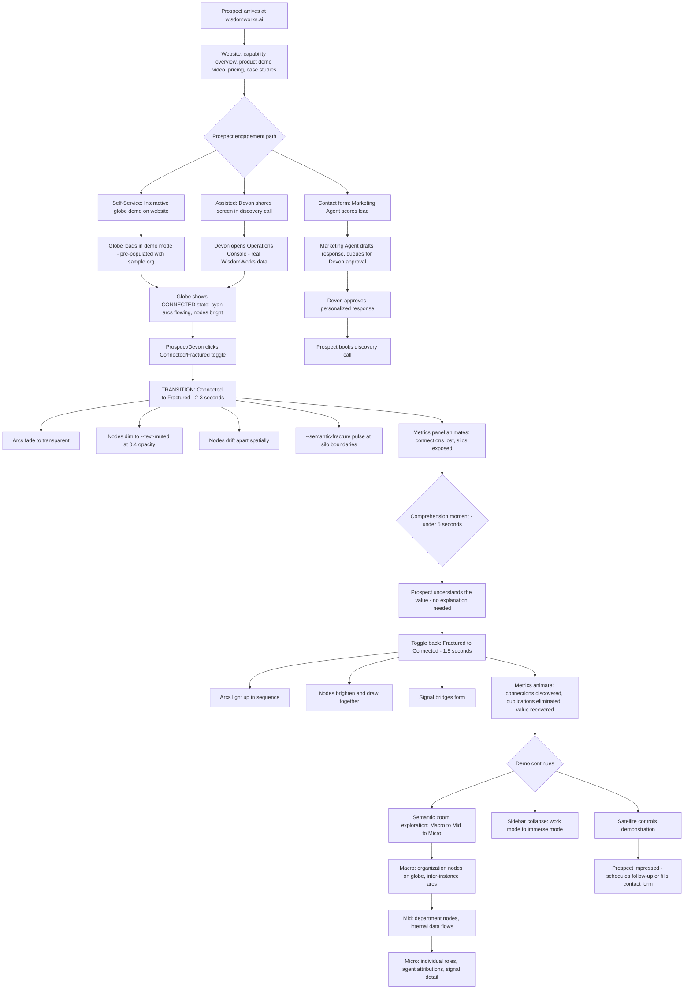
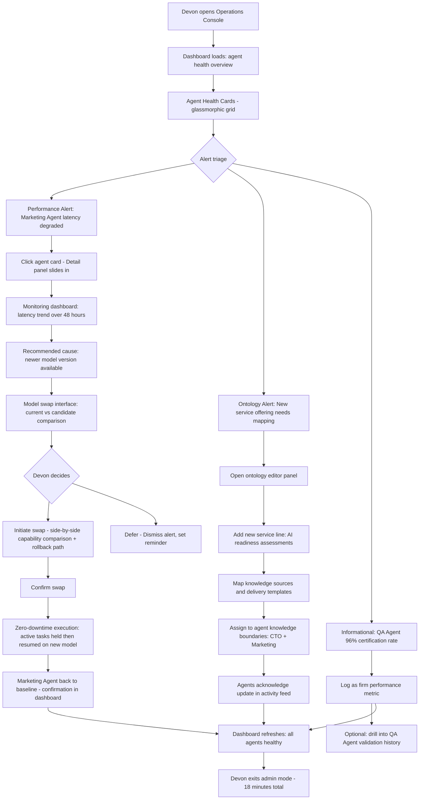
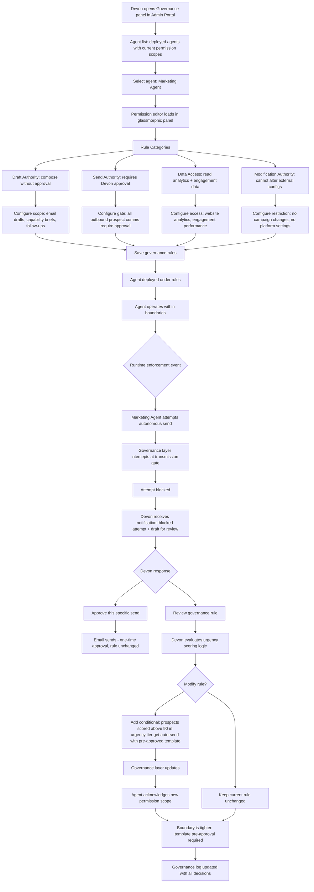

# UX Design Specification WisdomWorks

**Author:** Devon
**Date:** 2026-02-28

---

## Executive Summary

### Project Vision

WisdomWorks is an organizational intelligence platform where AI agents mirror every role in an organization. The MVP deploys as the operational backbone of WisdomWorks the AI consulting firm — Devon's Founder Agent orchestrates role agents to run the business. Three capability layers (Email Intelligence, Desktop Agent, Operations Console) define the platform's functional architecture, each with distinct UX surfaces.

The UX must serve dual purposes: it is Devon's daily operating environment AND the live demonstration that sells WisdomWorks to prospective clients. The interface itself is proof of the product thesis.

### Target Users

**MVP Primary User — Devon (All Roles):**
- Sole human operator during MVP champion phase
- Consolidates Founder, administrator, data engineer, and Axis team oversight into one experience
- Desktop-first workflow — agent chat window persistent on desktop, Operations Console for admin tasks
- Tech-savvy but values efficiency over complexity — the UX should remove friction, not add configuration

**External Audience — Prospective Clients:**
- Experience WisdomWorks through the public website and live dashboard demonstrations
- Must understand organizational intelligence value without deep explanation
- The web dashboard is the demo surface — designed for comprehension by strangers

**MVP Self-Deploying Platform Users — Any Business Owner:**
- Solo operators (electrician, cosmetician, barber, personal trainer) — mobile-first, never open a dashboard
- Small business owners (restaurant, retail, real estate) — primarily WhatsApp + voice, occasional web dashboard
- Mid-size org leaders (consulting firm, construction company) — web dashboard + desktop agent
- Tech-savvy to zero-tech range — the UX must adapt to the user, not the reverse
- Onboarding is conversational AI — no forms, no configuration wizards

**Personal Users — Individuals (Non-Business):**
- Students, aspiring leaders, creatives, health/wellness users
- Interact primarily via WhatsApp and voice
- May never see a web dashboard — their agent IS the product
- Privacy-first: health/wellness users need HIPAA-grade confidence in the UX

**Growth Users (Future):**
- Team members with personal agents across varying tech levels
- Managers viewing aggregated dashboards
- Client organizations with their own instances
- Cross-organization administrators managing inter-instance connections (e.g., DoD COCOMs)

### Design Language — Dark Glassmorphism with Cinematic Depth

**Visual Identity:**
- Dark-themed glassmorphism — frosted glass panels with blur effects, soft edges, subtle borders on translucent elements
- Moody, sophisticated aesthetic — deep purples, blues, warm accents — not sterile enterprise software
- Modern typography, clean structure, sidebar navigation pattern
- Three visual depth layers: cinematic images (back) → gradient wash (middle) → frosted glass UI panels (front)

**Design References:**
- Layout, theme, and color direction: Dribbble shot 26600719 (AI-powered Chat For Image Generating) — dark sidebar, glassmorphism panels, clean AI chat interface
- Background gradient and cinematic imagery: Dribbble shot 25955635 (Motra AI Cinematic Video Creation Platform) — rich gradient backgrounds with cinematic visual content
- Chat window: frosted glass gradient appearance with soft edges — the agent's embodiment on the desktop

**Cinematic Background Layer:**
- Slow-rotating gallery of cinematic images (world landscapes, abstract visuals) persists behind ALL UI surfaces — not limited to login/welcome
- Rotation style inspired by Windows screensaver — soft, continuous, creating a living, warm ambient feel
- Images visible through frosted glass panels at all times, creating depth and visual richness
- Background transitions are gentle — no abrupt changes, the images drift and crossfade
- Persists during Operations Console work, admin tasks, and dashboard views — WisdomWorks never looks like a spreadsheet

**Performance Considerations:**
- Cinematic image rotation + glassmorphism blur + 3D visualization = significant GPU demand
- Design system must define quality tiers: full fidelity on capable hardware, simplified blur/static gradient fallback on constrained environments
- Background image rotation may reduce framerate during heavy 3D interaction — define graceful degradation (pause rotation during active 3D manipulation, resume on idle)

### Platform Strategy — Desktop-First with Web Dashboard

**Desktop Application (Primary):**
- Agent chat window with frosted glass gradient appearance, soft edges — the agent's "presence" on the user's desktop
- Terminal channel for development tasks
- Desktop Agent Runtime controlling local applications
- Persistent connection to WisdomWorks platform

**Web Application (Dashboard & Visualization):**
- Operations Console, dashboards, and 3D visualization accessible via browser
- Doubles as the live demo surface for prospective clients
- Shares identical design language with desktop app — one product, two surfaces
- Multi-instance constellation view — see and manage connected organization environments

### 3D Globe Visualization — The Centerpiece

**Visual Foundation:**
- Aesthetic benchmark: Framer Earth 3D Globe Pro (dark theme, atmospheric glow, animated arc lines, dot matrix/minimal landmass rendering, auto-rotation, 60FPS)
- Information layer: Aceternity 3D Globe pattern (avatar/label callout markers at geographic coordinates, hover/click interaction, team distribution display)
- If an open-source library (Globe.gl, Three.js, React Three Fiber) cannot match the Framer globe aesthetic, purchase and extend the Framer component
- Architecture decision on rendering library deferred to Architecture workflow

**Semantic Zoom — Three Depth Levels:**

*Macro Level (Zoomed Out — Inter-Organization):*
- Globe shows organizations as glowing nodes at their physical locations
- Animated arc lines between nodes show inter-instance signal bridges (e.g., CENTCOM ↔ EUCOM connected, INDOPACOM floating isolated)
- Federation topology visible — which orgs are connected, which are isolated
- Inefficiency hotspots pulse at the org level — "this organization has a data connectivity gap in its East Coast operations"

*Mid Level (Zoomed to One Organization):*
- Globe transitions into the organizational intelligence graph
- Departments, teams, and roles appear as nodes at their geographic positions
- Signal arcs show data flow between teams — bright active arcs for healthy flow, dim disconnected nodes for silos
- Geographic context preserved — team in DC and team in San Diego physically positioned on globe
- Inefficiencies visible at the team/department level

*Micro Level (Zoomed Into a Team/Node):*
- Individual agents become visible — CTO Agent, Developer Agents, Marketing Agent, Founder Agent
- Signal flows between agents shown — delegation paths, deliverable handoffs, coordination arcs
- Specific inefficiency callouts — "this agent has flagged 3 workflow bottlenecks this week"
- Callout markers with detail panels on hover/click

**Multi-Instance Connectivity:**
- Each organization's WisdomWorks instance appears as a distinct entity on the globe
- Organizations can connect instances when both agree — mutual, governed connection
- Connected instances show visible signal bridges; isolated instances float independently
- DoD COCOM model as the visual metaphor: CENTCOM, EUCOM, INDOPACOM each with their own instance, connected when authorized for cross-COCOM intelligence sharing
- Connection governance rules define what signal types can cross the bridge

**Inefficiency Visibility — "The Organization is Flat":**
- All users see all inefficiencies — no role-based filtering of inefficiency data
- Consistent with PRD core philosophy: "The CTO agent and a junior developer agent have the same access to organizational intelligence. The difference is the dashboard view, not the knowledge."
- Inefficiencies displayed as pulsing hotspots on the globe surface at all zoom levels
- Transparency drives culture change — when people see gaps, they fill them
- This IS the thesis — making inefficiency data manager-only would turn WisdomWorks into surveillance, contradicting the core philosophy

### Key Design Challenges

1. **Glassmorphism + cinematic background + 3D globe performance** — three simultaneous GPU-intensive layers require careful performance budgeting, progressive quality reduction, and hardware-aware rendering; graceful degradation essential
2. **Semantic zoom transitions** — seamless visual and contextual transition between macro (inter-org), mid (intra-org), and micro (agent-level) views must feel spatial and natural, not like loading different pages
3. **Single-user role consolidation** — Devon operates as Founder, admin, and data engineer simultaneously; the UX must make role-switching feel seamless without interface overload
4. **Globe as functional tool, not decoration** — must be genuinely useful for data exploration, inefficiency detection, relationship mapping, and inter-organizational topology; intuitive controls without learning curve
5. **Agent output without notification fatigue** — surfacing briefings, artifacts, governance alerts, and engagement updates without overwhelming a single user; results-first, real-time agent activity available on-demand via dashboard

### Design Opportunities

1. **Frosted glass chat window as agent presence** — the glassmorphism aesthetic makes the agent feel ambient and alive, a companion alongside work; cinematic images drifting behind the glass reinforce the feeling of depth and life; naming the agent becomes visceral
2. **Globe as universal navigation** — the centerpiece visualization serves as both intra-org dashboard and inter-org topology; zoom level determines context; one continuous spatial experience from constellation to individual agent
3. **Multi-instance constellation as federation interface** — organizations appear as distinct glowing entities; connected orgs show signal bridges; the globe becomes the interface for managing organizational partnerships
4. **Progressive disclosure for role complexity** — the Operations Console reveals depth as needed; Founder view shows engagement status and agent health, admin mode deepens into ontology tables and model swap; one interface, multiple depth levels
5. **Web dashboard as live demo surface** — designed knowing strangers will see it; real data, real agent activity, comprehensible without explanation; the cinematic background and glassmorphism create an immediate premium impression

## Core User Experience

### Defining Experience

**WisdomWorks is a decision cockpit.** The core user action is making decisions — approve, reject, redirect, delegate. Every UX surface exists to either present synthesized information for a decision or execute a decision already made. Devon never hunts for information, aggregates data, or chases people. The agents do that. Devon decides.

The interaction loop: **Agents synthesize → Devon decides → Agents execute → Agents report.**

This loop runs continuously. The morning briefing is the most visible instance, but decisions happen throughout the day — approving a deliverable, redirecting a role agent, authorizing a client communication, adjusting a governance rule. The UX must make every decision point instantly recognizable and resolvable with minimal friction.

### Platform Strategy

**Desktop-First with Web Dashboard:**

- **Desktop app (primary daily surface):** Frosted glass chat window as the agent's persistent presence. Terminal channel for development. Desktop Agent Runtime for application control. The chat window is where most decisions happen — the agent presents, Devon decides, the agent executes.
- **Web app (visualization & demo surface):** Operations Console, 3D globe visualization, dashboards, agent activity monitoring. Accessible via browser for Devon and for prospective client demonstrations. Shares identical dark glassmorphism design language.
- **Input: mouse/keyboard primary.** Touch interaction not required at MVP. Mobile optimization deferred to Growth.
- **Offline consideration:** Desktop agent runtime must handle intermittent connectivity gracefully — pre-computed artifacts, local caching, reconnection protocols. The agent doesn't stop working because the network hiccups.

### Effortless Interactions

**Everything should feel effortless.** This is not aspirational — it's a design constraint. If an interaction requires Devon to think about *how* to do it rather than *what* to decide, the UX has failed.

**Specifically effortless:**

- **Decision flow:** Information presented → decision made → delegation happens. No extra clicks, no navigation to a different screen, no "are you sure?" dialogs on routine decisions. The briefing is the decision interface.
- **Report generation:** The Founder Agent actively orchestrates report assembly — requesting data from role agents, pursuing agents that haven't responded, escalating when needed. Reports assemble from the natural flow of inter-agent communication the same way the morning briefing assembles from overnight signal activity. Devon reviews the finished product, not the pieces. Devon never opens PowerPoint, Excel, or Word.
- **Policy and knowledge questions:** Agents answer common knowledge questions and direct policy references (with source links) autonomously — no approval needed. "Here's the travel reimbursement policy" with a link to the source document is a lookup, not a decision. Only interpretation, judgment calls, and sensitive topics route to Devon for review. The governance boundary is on interpretation, not information retrieval.
- **Task management and reminders:** Agents remind people about timecards, deadlines, and deliverables. Devon doesn't chase. The absence of chasing is the UX.
- **Knowledge capture:** Data relationships are discovered by the signal layer and mapped by the ontology — not manually extracted from email by Devon and entered into an information system. The information system builds itself from email that's already being written.
- **Behavior change:** There is none. WisdomWorks works on email people already send. No new tool to learn, no new interface to adopt, no workflow to change. This is the fundamental UX decision that eliminates the adoption problem that killed every previous knowledge management system.

### Critical Success Moments

1. **The Morning Briefing (Daily — Make or Break):** Devon opens WisdomWorks at 7:42 AM. The Founder Agent has already synthesized the morning — client engagements, prospect inquiries, deliverable status, governance alerts. Four decisions in under ten minutes. If this touchpoint is cluttered, unclear, or requires digging, the product fails at its most important moment.

2. **The Invisible Completion:** Devon realizes something he used to spend time on — chasing a report, reminding someone about their timecard, answering a policy question — already happened. The agent handled it within governance boundaries without asking. The absence of a task is the proof of value.

3. **The Knowledge Connection:** Two pieces of information that lived in separate inboxes are now linked on the globe. A relationship Devon would have spent days surfacing through manual outreach is visible as a pulsing arc on the visualization. This is the silo-breaking event — the single validated connection that proves the core thesis.

4. **The Client Demo Moment:** The globe alone doesn't create understanding — WisdomWorks is a new frontier with no frame of reference. The demo requires a narrative layer on top of the visualization:
   - **Guided callouts** that narrate what the audience is seeing: "This arc represents 47 knowledge connections discovered between your East Coast and West Coast teams that no one knew existed"
   - **Before/after framing** that translates data into business impact: "This silo existed for 3 years. WisdomWorks found and bridged it in 11 days"
   - **Demo mode / walkthrough layer** on the globe that tells the story — contextual tooltips, narrative overlays, and step-by-step guided exploration for first-time viewers
   - The globe is the canvas. The callouts are the story. Without the story, it's a screensaver.

5. **The Adoption Non-Event:** WisdomWorks deploys and people just... use it. Because they're using email, which they were already doing. No training sessions, no change management campaigns, no adoption dashboards tracking who hasn't logged in. The hardest UX problem in enterprise software — getting people to change their behavior — is solved by not asking them to.

### Experience Principles

1. **Decisions, not data.** Never present raw information when a synthesized recommendation is possible. Every screen, notification, and briefing should answer "what should Devon do?" not "here is some data."

2. **Absence is the feature.** The best UX moments in WisdomWorks are things NOT happening — reports Devon doesn't build, people Devon doesn't chase, meetings that don't need to occur. The interface should celebrate what disappeared, not just what appeared.

3. **The agent is present, not in the way.** The frosted glass chat window is always there — ambient, alive, drifting cinematic images behind it. But it doesn't interrupt. Results surface; activity stays in the dashboard. Devon pulls detail when he wants it; the agent doesn't push unless governance requires human approval.

4. **The globe tells the truth.** The 3D visualization doesn't hide inefficiencies, filter by role, or soften reality. Everyone sees the same organizational intelligence. Transparency is not a feature — it's the product philosophy made visible. The organization is flat.

5. **Zero behavior change, infinite value.** The UX never asks users to learn something new, adopt a new tool, or change how they work. Email in, intelligence out. The hardest problem in enterprise software — adoption — is architecturally eliminated.

6. **Autonomous where safe, gated where judgment matters.** Agents handle lookups, reminders, report assembly, and routine coordination autonomously. They route interpretation, sensitive decisions, and external communications requiring judgment to Devon. The governance boundary is on judgment, not information.

## Desired Emotional Response

### Primary Emotional Goals

**For Devon (Daily Operator):**
- **Quiet confidence.** The 7:42 AM feeling — coffee in hand, day already planned, tasks completable with ease. Devon is there for the hard decisions. The data drives those decisions. The UX should feel like a well-organized command deck where everything is in its place, not a firehose of alerts demanding attention.
- **Renewed sense of time.** Tedious tasks are gone. The hours Devon used to spend chasing reports, building presentations, answering policy questions, reminding people — those hours are returned. The emotional response isn't just efficiency; it's freedom.
- **Creative empowerment.** Solutions can be created at any time. The BMAD engine, the role agents, the organizational intelligence — they amplify Devon's ability to build, solve, and innovate. The employee becomes dramatically more effective at their job.

**For Prospective Clients (Demo Audience):**
- **Awe.** This is the future. They're seeing something that doesn't exist anywhere else.
- **Envy.** They want this for their organization. The demo isn't abstract — they see a real consulting firm running on this platform.
- **Urgency.** They're falling behind without this. Before/after framing makes the cost of inaction concrete.

**For All Users (Platform-Wide):**
- **Excitement** about what's possible — not just task completion, but discovery, connection, innovation
- **Trust** that the system respects privacy, governs agent behavior, and surfaces truth without surveillance
- **Belonging** to an organization that operates transparently — the flat intelligence philosophy makes people feel included, not monitored

### Emotional Positioning — "AI is Your Workforce"

WisdomWorks isn't competing with Copilot or Glean. It's not an AI assistant. It's not a dashboard. It's the first platform where **AI agents run a business.** The Founder Agent isn't helping Devon — it's operating alongside him.

The emotional positioning is not "AI makes you more productive." It is: **"You've been managing an organization. What if the organization managed itself — and you just made the decisions?"**

That's the narrative spine. That's the line that makes a room go quiet. The globe proves it's real. The cinematic background, the frosted glass, the atmospheric glow — they exist to say: "You've crossed into something new." This is a new frontier in technology and productivity.

### Emotional Journey Mapping

| Moment | Desired Emotion | Design Implication |
|--------|----------------|-------------------|
| First launch / login | Wonder + anticipation — cinematic images drifting, globe slowly rotating, the product feels alive before you touch anything | Cinematic background visible immediately, globe auto-rotating on load, no loading spinners or blank states |
| Morning briefing opens | Quiet confidence — everything is synthesized, prioritized, ready for decisions | Clean briefing layout, decisions as clear approve/reject/redirect actions, not walls of text |
| Making a decision | Effortless authority — one action, immediate delegation, no friction | Inline action buttons, no modal confirmations for routine decisions, subtle animation confirming propagation |
| Agent surfaces a connection | Surprise + validation — delivered through briefing, chat, or email, not requiring globe exploration | Agents proactively surface connections via the user's active channel; globe is for spatial exploration after, not discovery before |
| Agent identifies stakeholders for a solution | Relief — the hardest part of knowledge management (finding the right people) just evaporated | Solution briefs include mapped stakeholders with roles, expertise, and availability; stakeholder nodes animate on the globe like a circuit completing |
| Realizing a task was handled automatically | Relief + trust — the absence of work is the emotional payoff | Subtle "completed autonomously" indicators in briefing; celebrates absence quietly |
| Client demo — DoD org | Controlled alarm → relief — "your COCOMs have 47 cross-program connections no one knew about; 3 are active duplication costing $2M" | Demo narrative zooms into COCOM node, shows discovered connections with cost quantification |
| Client demo — Gov contractor | Recognition — they've lived this problem, watched knowledge walk out the door | Demo shows Marcus's vulnerability scanner found by 3 teams that didn't know it existed; "How long would it take your org?" |
| Client demo — Commercial org | Envy — they see what their firm could be | Demo shows cross-city knowledge connection with auto-identified stakeholders; "WisdomWorks doesn't just find the connection — it identifies who should be on the call" |
| Something goes wrong | Calm reassurance → precise understanding → transparent resolution | Error states in same glassmorphism aesthetic, plain language explanation, system caught and corrected it, resolution logged visibly |
| Returning the next day | Anticipation + reliability — "what did my agents accomplish overnight?" | Morning briefing always populated, always synthesized, always ready |

### Demo Mode — Three Org-Type Narratives

The demo mode is not one walkthrough — it's three selectable narratives. The prospect picks their org type and sees their story told through the globe:

**DoD Organization:**
- Narrative: "Your COCOMs operate in isolation by design. But within each COCOM, knowledge is still siloed across programs."
- Globe zooms into a COCOM node, shows cross-program connections discovered, quantifies duplication cost
- Emotional arc: controlled alarm → relief → "the answer is already here"

**Government Contractor:**
- Narrative: "Your company has 4,000 people across 30 contracts. Marcus on the cyber contract built a vulnerability scanner. Three other contracts need exactly that tool and don't know it exists."
- Globe shows the arc connecting Marcus to three teams; "WisdomWorks found that in 11 days. How long would it take your organization?"
- Emotional arc: recognition → urgency → "we've been living this problem"

**Commercial Organization:**
- Narrative: "Your professional services firm has consultants across 12 cities. When a client asks about AI readiness, your Chicago team has already delivered three engagements on that exact topic. But Atlanta doesn't know that."
- Globe shows knowledge connection, then animates stakeholder nodes lighting up in sequence
- Emotional arc: envy → desire → "I want this for my firm"

### Micro-Emotions

**Critical Emotional States:**

- **Confidence over confusion.** Every interaction reinforces "I know what's happening and what to do next." If information requires interpretation, the agent provides a recommendation — Devon decides, not deciphers.
- **Trust over skepticism.** Privacy boundaries hold visibly. Governance rules enforce visibly. Trust is earned through transparency, not claimed through reassurance copy.
- **Excitement over anxiety.** New discoveries feel like opportunities, not obligations. The notification tone is "look what we found" not "action required."
- **Accomplishment over frustration.** Every decision results in visible forward motion. The feedback loop between decision and result must be tight enough that Devon sees impact, not just input.

**Emotions to Actively Avoid:**

- **Surveillance anxiety.** No employee should ever feel watched. Dashboards show organizational intelligence, not individual monitoring.
- **Alert fatigue.** Results surface; activity stays in the dashboard. Devon pulls when ready; the system doesn't push unless governance-critical.
- **Imposter syndrome.** Progressive disclosure means complexity is available but never imposed. The Founder view is simple. Admin depth exists when Devon wants it.
- **Loss of control.** Devon sets the governance rules, agents follow them, boundary violations surface immediately.

### Design Implications

| Emotional Goal | UX Design Approach |
|---------------|-------------------|
| Quiet confidence | Morning briefing as clean, prioritized decision surface. Muted dark glassmorphism that doesn't compete for attention. Decisions first, context second, detail on demand |
| Renewed sense of time | "Completed autonomously" section showing what agents handled. Time-saved metrics: "3.2 hours of manual work eliminated this week" |
| Creative empowerment | BMAD engine accessible from any context. "What if..." is a natural starting point, not a separate tool |
| Awe (demo) | Globe auto-rotation with atmospheric glow as first visible element. Cinematic background creates immediate premium impression |
| Envy (demo) | Real data, real agents, real results. The demo IS the product. Gap between what they have and what they're seeing is self-evident |
| Urgency (demo) | Before/after framing quantifies waste. Three org-type narratives make it personal to the prospect's context |
| Stakeholder discovery | Solution briefs include auto-mapped stakeholders with roles and expertise. Globe animates stakeholder nodes lighting up in sequence — the organizational intelligence assembling a team in real-time |
| Trust | Privacy indicators ambient. Governance audit trail one click away. Agent actions logged and reviewable. No hidden automation |
| Calm error handling | Errors in same glassmorphism aesthetic. Plain language. "The system caught it, corrected it, here's what happened." |
| New frontier | Cinematic background + 3D globe + frosted glass depth = "this is technology from the future, but it's here now and it's warm, not cold" |

### Emotional Design Principles

1. **Quiet over loud.** WisdomWorks communicates through presence, not interruption. The cinematic background drifts. The globe rotates. The agent waits behind frosted glass. Nothing demands attention — everything rewards it.

2. **Earned trust, not declared trust.** The product never says "your data is safe" while the UX proves it through visible privacy boundaries, accessible audit trails, and governance rules that enforce in real-time.

3. **The new frontier is warm.** Futuristic doesn't mean cold. The cinematic images, the soft glassmorphism edges, the atmospheric globe glow — they create a frontier that feels inviting, not intimidating. Advanced technology that feels like a place you want to be.

4. **Celebrate absence.** The most powerful emotional moments are things that didn't happen — reports not built, meetings not held, people not chased. "3 hours reclaimed" hits harder than "15 tasks completed."

5. **Escalate wonder, not workload.** Every new discovery increases excitement, not anxiety. "Look what we found" — an invitation to explore, not an obligation to act.

6. **Agents bring it to you.** Connections, solutions, stakeholder maps, efficiency suggestions — agents surface these proactively through the morning briefing, chat, or email. The user doesn't hunt. The globe is for exploration after the agent told you something interesting exists.

7. **The demo tells their story.** Three org-type narratives ensure every prospect sees themselves in the product. The globe is the canvas. The callouts are the story. The stakeholder assembly animation is the proof. "You've been managing an organization. What if the organization managed itself?"

## UX Pattern Analysis & Inspiration

### Inspiring Products Analysis

**Perplexity.ai — Answer-First Intelligence**

Perplexity represents the closest philosophical cousin to WisdomWorks' decision cockpit. What it does well:

- **Answer-first, sources second.** The synthesized response leads. Citations exist but don't interrupt the flow. This maps directly to WisdomWorks' principle: "Decisions, not data." The morning briefing should feel like Perplexity's response panel — the agent's synthesis is front and center, supporting evidence accessible but never cluttering the primary surface.
- **Clean information hierarchy.** No sidebars competing for attention, no notification badges pulling your eye. The content IS the interface. For WisdomWorks: the briefing, the globe, the chat — each surface should command full attention when active.
- **Conversational continuity.** Follow-up questions build on context naturally. WisdomWorks' agent chat should maintain this same thread intelligence — Devon's conversation with the Founder Agent carries context forward, never requiring re-explanation.

**ChatGPT & Claude — Conversational Simplicity**

The gold standard for AI chat interfaces, and directly relevant to WisdomWorks' desktop chat window:

- **Message-thread model.** Clean input, clean response, clean history. No configuration panels, no mode selectors, no toolbars competing with the conversation. The chat IS the product surface.
- **Minimal chrome, maximum content.** The interface disappears — you're talking to intelligence, not operating software. WisdomWorks' frosted glass desktop chat should feel this same way: the glassmorphism creates presence and depth, but the interaction model is as simple as typing and reading.
- **Effective yet simple.** Both platforms prove that sophisticated AI capability doesn't require sophisticated UI. The most powerful interactions happen through the simplest interface patterns. This validates WisdomWorks' approach: the agent does the complex work, the UX stays clean.

**LomoHiber Neumorphism + Glassmorphism UI Kit — The Aesthetic Blueprint**

This kit (by Vladimir Tsagolov) crystallizes the hybrid visual language WisdomWorks needs:

- **Neumorphic controls** — buttons, toggles, and action elements that feel softly extruded from (or pressed into) the dark surface. Subtle dual shadows (light highlight on one edge, dark shadow on the other) create tactile depth without breaking the monochromatic palette. These controls surrounding the globe create a cockpit feel — physical, grounded, purposeful.
- **Glassmorphic panels** — frosted translucent surfaces for content areas, chat windows, and information displays. The cinematic background bleeds through, creating visual richness without competing with the content. Panels feel layered in physical space.
- **Hybrid harmony** — neumorphic for interactive elements (buttons, sliders, toggles, action controls), glassmorphic for content containers (briefing panels, chat, detail views). Two visual languages that serve distinct purposes within one cohesive system.
- **Dark theme premium** — the deep purples, blues, and warm accents on dark backgrounds create the sophisticated, moody aesthetic that separates WisdomWorks from sterile enterprise software.

### Transferable UX Patterns

**Navigation Patterns:**

- **Globe-centric spatial navigation.** The globe IS the navigation. No traditional sidebar menu hierarchy for the Operations Console — semantic zoom (macro → mid → micro) replaces page navigation. Action controls orbit the globe as neumorphic elements, grounding interaction in the physical metaphor.
- **Conversational navigation (desktop chat).** Following ChatGPT/Claude's model — natural language replaces menu selection. Devon tells the agent what he needs; the agent navigates the system. The chat window is the universal command surface.
- **Answer-first information flow (Perplexity model).** Every surface leads with the synthesis, supports with evidence. Briefings show decisions first, context second. Globe shows patterns first, data points on drill-down.

**Interaction Patterns:**

- **Neumorphic action controls around the globe.** Filter toggles, zoom controls, layer selectors, time-range sliders — all rendered as soft-pressed neumorphic elements orbiting the globe. They feel like physical cockpit instruments, reinforcing the "command deck" metaphor.
- **Contextual control surfaces.** The neumorphic controls around the globe reconfigure based on semantic zoom level. Macro zoom (inter-org): federation controls — connect, disconnect, signal type filters. Mid zoom (intra-org): department filters, data flow toggles, inefficiency layer controls. Micro zoom (agent level): individual agent actions — delegate, redirect, inspect. The cockpit adapts to what you're looking at, teaching the user that zoom isn't just visual — it's contextual. Each zoom level is a different operational space.
- **Glassmorphic content panels.** Briefings, detail views, agent responses, stakeholder maps — all presented on frosted glass panels that float over the cinematic background. Content is readable; depth is preserved; the experience stays immersive.
- **Inline decisions (ChatGPT simplicity applied to governance).** Approve/reject/redirect rendered as clean neumorphic buttons within the briefing flow. No modal dialogs, no page transitions for routine decisions. The decision happens where the information lives.

**Visual Patterns:**

- **Cinematic depth layering.** Three visual planes: cinematic images (deep background) → gradient wash (atmosphere) → frosted glass/neumorphic UI (interaction surface). This creates the immersive "new frontier" feeling without the background ever competing with the content.
- **Attention-aware ambient motion.** Cinematic background crossfade pauses during active interaction — decision-making, globe manipulation, reading briefings. Resumes gently on idle (~15 seconds). Globe auto-rotation follows the same rule. The system breathes with Devon's focus: motion exists for ambience during rest, stillness exists for clarity during work. The product feels aware of the user's engagement state.
- **Monochromatic neumorphism on dark palette.** Controls share the background's color family (deep purples, blues) with shadow differentiation creating depth. The result: controls feel embedded in the environment, not placed on top of it.
- **DOM overlay architecture for neumorphic controls.** Neumorphic controls rendered as CSS layers above the WebGL globe canvas. Visually integrated with the globe — appears as one cohesive cockpit surface. Architecturally independent — enables faster design iteration, accessibility compliance testing, and decoupled development cycles without touching the 3D rendering pipeline.

### Anti-Patterns to Avoid

- **Dashboard overload.** Enterprise platforms like Salesforce, ServiceNow, and Jira pile widgets, charts, metrics, and navigation into every pixel. WisdomWorks must resist this — the globe IS the dashboard. Surrounding it with traditional dashboard widgets would destroy the immersive experience and bury the spatial metaphor under flat UI conventions.
- **Notification-heavy interruption.** Slack's badge anxiety, Teams' constant toast notifications — these create the opposite of quiet confidence. WisdomWorks surfaces results through the briefing and agent channels; it never interrupts with "12 unread" badges pulling attention away from the current context.
- **Flat enterprise aesthetic.** Gray headers, white cards, blue links, data tables — the default enterprise software look communicates "tool" not "frontier." The neumorphism + glassmorphism + cinematic depth stack exists specifically to prevent WisdomWorks from ever feeling like a spreadsheet with a login page.
- **Configuration complexity.** Power-user interfaces that require learning (Notion's block types, Figma's panel management, Grafana's query builder) conflict with WisdomWorks' "zero behavior change" principle. The agent handles complexity; Devon sees decisions.
- **Glassmorphism without purpose.** Frosted glass effects purely for aesthetics (with no content behind the glass) look hollow. Every glassmorphic panel in WisdomWorks must have the cinematic background or globe visible through it — the transparency is functional (creating depth), not decorative.
- **Neumorphism accessibility gaps.** Pure neumorphism can suffer from low contrast on interactive elements. WisdomWorks must ensure neumorphic controls have sufficient contrast ratios for readability — subtle glow states, hover highlights, and focus indicators that maintain the aesthetic while meeting accessibility thresholds.

### Design Inspiration Strategy

**What to Adopt:**

- **Perplexity's answer-first hierarchy** — synthesis leads, evidence supports, every surface answers "what should Devon do?" before "here is some data"
- **ChatGPT/Claude's conversational simplicity** — the desktop chat window follows this exact model: minimal chrome, maximal conversation, the glass aesthetic adding presence without complexity
- **LomoHiber's hybrid approach** — neumorphic interactive controls + glassmorphic content containers as the foundational visual language
- **Globe-centric layout** — the 3D visualization centered, neumorphic controls orbiting it like cockpit instruments, no traditional dashboard sidebar competing for primacy
- **Attention-aware motion** — ambient motion pauses during active interaction, resumes on idle; the system breathes with the user

**What to Adapt:**

- **Perplexity's source attribution** → WisdomWorks adapts this as "agent attribution." When the briefing presents a synthesis, the contributing agents are visible but secondary — "Synthesized by Founder Agent from CTO, Marketing, and QA inputs." Tap to expand the reasoning chain, but the recommendation leads.
- **Chat simplicity** → WisdomWorks adapts the clean chat model but adds the frosted glass depth layer and cinematic background bleed-through. The interaction is ChatGPT-simple; the presence is WisdomWorks-premium.
- **Neumorphic controls** → Adapted for dark theme with the deep purple/blue palette. Standard neumorphism uses light backgrounds; WisdomWorks inverts this to dark-mode neumorphism where controls are softly embossed/debossed against the dark surface with subtle highlight edges.
- **Contextual control surfaces** → Zoom-level-driven control reconfiguration adapted from flight cockpit HUD concepts. Each semantic zoom level renders its own control panel component, creating a state-machine-driven UI that teaches through interaction.

**What to Avoid:**

- **Enterprise dashboard conventions** — no widget grids, no metric tile arrays, no sidebar-plus-topbar navigation frameworks. The globe and chat are the primary surfaces; everything else is progressive disclosure.
- **Notification-driven engagement** — no badges, no toast alerts, no "action required" anxiety. Results surface through briefings; activity stays in the dashboard for on-demand review.
- **Visual effects competing with content** — the cinematic background, glassmorphism, and globe all serve immersion; none should ever make text harder to read, decisions harder to parse, or interactions harder to complete. Immersion supports the message; it never fights it.

## Design System Foundation

### Design System Choice

**Headless Primitives + Custom Theme: Radix UI + Tailwind CSS + shadcn/ui**

WisdomWorks adopts a headless-first design system architecture — accessible, battle-tested interaction primitives (Radix UI) styled through a fully custom WisdomWorks theme layer (Tailwind CSS), with shadcn/ui as the component starter kit that is copied into the project and owned entirely by the team.

This is not an off-the-shelf design system with overrides. It is a custom design system built on proven behavioral foundations. The visual layer — neumorphism, glassmorphism, cinematic depth — is 100% WisdomWorks. The interaction layer — keyboard navigation, focus management, screen reader support, dropdown positioning — is 100% Radix.

### Rationale for Selection

**Why not a fully custom system?**
- Solo developer at MVP. Building accessible dropdowns, focus traps, keyboard navigation, and scroll locking from scratch is weeks of work that delivers zero visual differentiation. Radix solves these invisibly.

**Why not Material UI, Ant Design, or Chakra UI?**
- These systems carry strong visual opinions. Material looks like Google. Ant looks like enterprise dashboards. Achieving dark neumorphism + glassmorphism on top of any of these means fighting their defaults — overriding shadows, replacing color systems, unwinding spacing tokens. The override tax exceeds the benefit.
- WisdomWorks' aesthetic IS the product thesis. The demo surface must look like nothing else. An off-the-shelf system's visual DNA leaking through would undermine the "new frontier" positioning.

**Why Radix + Tailwind + shadcn/ui?**
- **Radix UI** provides zero-opinion accessibility primitives: dialogs, popovers, dropdowns, toggles, tabs, tooltips, sliders — all with correct ARIA attributes, keyboard handling, and focus management. No visual style attached. WisdomWorks themes them completely.
- **Tailwind CSS** enables utility-first custom styling. Neumorphic shadows, glassmorphic blurs, dark palette colors, and motion tokens live as Tailwind configuration — reusable, consistent, and maintainable as design tokens rather than scattered CSS.
- **shadcn/ui** bridges the gap: pre-composed Radix + Tailwind components that are copied into the project (not installed as a dependency). Full ownership. Full customization. No version lock-in. Components serve as starting points that get restyled to the WisdomWorks aesthetic.

### Implementation Approach

**Design Token Architecture:**

The WisdomWorks theme layer defines custom tokens as CSS custom properties on `:root`, with Tailwind configured to reference those properties. This enables runtime-adaptive rendering — one build serving both desktop (Electron/Tauri) and web contexts with different GPU capabilities.

**Token Categories:**

1. **Neumorphic Shadows** — emboss, deboss, pressed, hover, and active states. Dual-shadow system (light highlight + dark shadow) calibrated for dark backgrounds. Tokens: `--neu-shadow-raised`, `--neu-shadow-pressed`, `--neu-shadow-hover`, `--neu-shadow-active`.

2. **Glassmorphic Surfaces** — backdrop blur levels, panel opacity tiers, border opacity, and frosted edge softness. Tokens: `--glass-panel` (standard content), `--glass-chat` (desktop chat window), `--glass-overlay` (modal/detail panels), `--glass-subtle` (low-emphasis containers).

3. **Dark Palette** — deep purples, blues, warm accents, and neutral darks. Primary, secondary, accent, surface, and text color scales. Tokens follow semantic naming: `--surface-primary`, `--surface-elevated`, `--accent-warm`, `--text-primary`, `--text-muted`.

4. **Motion** — crossfade duration, idle detection threshold, globe rotation speed, transition easing curves, and attention-aware pause/resume behavior. Tokens: `--motion-ambient` (background drift), `--motion-transition` (UI state changes), `--motion-globe` (rotation and zoom), `--motion-idle-threshold` (15s default). All motion tokens include `prefers-reduced-motion` media query override — when the OS accessibility setting is enabled, all ambient motion tokens resolve to `0`. No crossfade, no globe rotation, static background. The attention-aware system still functions but starts from a paused state. The result: a still-beautiful static composition that preserves the glassmorphism and neumorphism aesthetic without any motion.

5. **Quality Tiers** — progressive degradation tokens for hardware-constrained environments. Runtime detection via `useQualityTier()` hook sets `data-quality` attribute on root element. CSS selectors branch on `[data-quality]` for tier-specific token values.
   - `full`: all blur + animation + 3D at 60fps
   - `reduced`: simplified blur, 30fps globe, static gradient background
   - `minimal`: no blur, static background image, 2D globe fallback

**Component Strategy:**

- **Neumorphic components** (buttons, toggles, sliders, icon buttons): Custom Tailwind-styled components using neumorphic shadow tokens. Used for all interactive controls, especially globe-orbiting cockpit controls.
- **Glassmorphic components** (panels, cards, chat bubbles, modal overlays): Custom Tailwind-styled containers using glassmorphic surface tokens. Used for all content display surfaces.
- **Radix-powered components** (dropdowns, dialogs, popovers, tabs, tooltips): shadcn/ui starters restyled with WisdomWorks tokens. Accessibility and behavior from Radix; visual identity from WisdomWorks theme.
- **Globe overlay components** (contextual control panels per zoom level): DOM-layer components positioned over the WebGL canvas via `GlobeControlsLayout` bridge component. Uses `ResizeObserver` on canvas container and computes control positions as percentages of canvas dimensions. Globe renderer doesn't know about UI. UI doesn't know about WebGL. The bridge translates canvas geometry into CSS positioning. Each zoom level (`macro | mid | micro`) renders its own control panel component via state machine.

### Customization Strategy

**Shared Component Library:**
- Desktop app (Electron/Tauri) and web app share one React component library
- Identical design tokens (CSS custom properties), identical visual language, two deployment surfaces
- Component variants handle surface-specific differences (e.g., chat window chrome on desktop vs. browser)
- Quality tier detection runs at initialization per rendering environment — GPU capability assessment → tier selection → `data-quality` attribute → token values resolved

**shadcn/ui Maintenance Strategy:**
- `shadcn-base/` reference directory maintained alongside `ui/` components
- When Radix ships accessibility fixes, diff `shadcn-base/` against upstream, cherry-pick behavior fixes into `ui/` components
- Never auto-update styles — WisdomWorks neumorphic/glassmorphic restyling is preserved
- Owned components with traceable upstream lineage

**Theme Extension Points:**
- All tokens as CSS custom properties on `:root` — runtime-switchable for future client-branded instances
- Client organizations could have their own color palette tokens loaded at runtime without rebuilding the component library
- Same components, different `:root` variables — brand customization as configuration, not code
- Accessibility high-contrast mode achievable through token override layer

**Tailwind Version Strategy:**
- Token specification is version-agnostic — CSS custom properties work with Tailwind v3 (`tailwind.config.js`) or v4 (`@theme` directives)
- Version selection deferred to Architecture workflow
- Tailwind v4's CSS-first `@theme` configuration would integrate tokens as a single source of truth — noted as preferred if architecture permits

**Accessibility Compliance:**
- Radix primitives handle ARIA attributes, focus management, and keyboard navigation
- Neumorphic contrast ratios validated against WCAG 2.1 AA — subtle glow states and border highlights ensure interactive elements remain distinguishable
- Glassmorphic panels maintain minimum text contrast regardless of background image content — text surfaces use sufficient opacity floors
- `prefers-reduced-motion` respected at the token layer — graceful degradation to static composition

## Defining Experience

### The Three Defining Experiences

**"WisdomWorks eliminates information silos."**

WisdomWorks' defining experience is not a single interaction — it is a **value chain of three experiences** that reinforce each other. Each serves a different audience, answers a different question, and occupies a different UX surface. Together they form the product.

**Experience 1: The Axis Team Maps (Foundation)**
*"How does this organization actually work?"*

The Axis team — WisdomWorks' human intelligence consultants — maps the client organization's structure, relationships, knowledge pockets, and data flows. They configure the ontology, establish signal pipelines, and make a messy real-world organization legible to the intelligence layer. Without this work, agents have no context and the globe has nothing to visualize.

- **UX Surface:** The same glassmorphic chat interface everyone uses — the agent understands ontology correction commands naturally. Inline ontology corrections from the globe or any content surface: see a miscategorized connection, a wrong department mapping, an entity that should be linked? Correct it through chat or a contextual edit panel on the globe. No separate "admin mode" needed.
- **Audience:** WisdomWorks Axis team members (internal)
- **Defining moment:** The Axis team validates their mapping work on the globe and sees the connections they expected appearing as arcs. The organizational model is alive.
- **Progressive disappearance:** Early in an engagement, the Axis team does heavy construction — mapping departments, configuring ontology, establishing pipelines. Over time, the intelligence layer self-reinforces through agent learning and signal accumulation. The Axis team's role shifts from building to tuning. The UX reflects this progression — from active construction interfaces to monitoring and refinement dashboards.

**Experience 2: The Agent Acts (Daily Experience)**
*"What should I do next?"*

Every user gets an AI agent at their side — answering questions, building solutions, supporting decisions, executing delegated tasks, and eliminating tedious work. The agent is the most democratic experience: everyone gets one, everyone benefits. This is where WisdomWorks lives daily.

- **UX Surface:** Desktop chat window (frosted glass, conversational simplicity), briefings, inline decision flows
- **Audience:** Every user — Devon, Axis team members, client organization employees (Growth phase)
- **Defining moment:** "I described a problem to my agent. It analyzed the organizational intelligence, identified three teams with relevant expertise, mapped the stakeholders, drafted a solution brief, and presented it for my review. I approved it in two clicks. That solution would have taken me two weeks to assemble manually."
- **Key capabilities:**
  - **Question answering** — policy questions, knowledge retrieval, with source attribution. Common knowledge answered autonomously; interpretation routed to decision-makers.
  - **Solution building** — the agent doesn't just retrieve information; it synthesizes, proposes, and constructs. Problem description in, solution brief with mapped stakeholders out.
  - **Decision support** — morning briefings, synthesized recommendations, approve/reject/redirect with zero friction. The agent presents; the user decides; the agent executes.
  - **Autonomous task execution** — reminders, report assembly, routine coordination handled within governance boundaries without asking. The absence of work is the proof of value.
  - **User learning and memory** — the agent builds a model of its user over time: past decisions, preferred solutions, coordination patterns, expertise areas. When a similar situation arises, the agent references what worked before: "Last quarter you handled a similar cross-team knowledge gap by connecting the Chicago and Atlanta leads directly. Want me to set up the same pattern here?" No duplicate questions. No repeating coordination that already has a proven playbook. The agent learns the user's judgment patterns and applies them proactively within governance boundaries.

**Experience 3: The Globe Reveals (Proof)**
*"What does our organizational intelligence look like?"*

The globe visualization makes organizational truth visible. The connected/fractured toggle is the proof that WisdomWorks works — one flip and the value is self-evident. The globe serves comprehension, exploration, and demonstration.

- **UX Surface:** 3D globe visualization with semantic zoom, neumorphic cockpit controls, connected/fractured toggle
- **Audience:** Devon (daily health check), Axis team (mapping validation and inline correction), prospects (demo), all users (exploration)
- **Defining moment:** Toggle from connected to fractured view. Connection arcs fade. Nodes go dark. Silos become visible as gaps. Toggle back — the organization comes alive. The visual gap IS the value proposition. No explanation needed.
- **Connected/Fractured toggle mechanics:**
  - **Connected → Fractured:** Arcs fade, nodes dim and drift apart, signal bridges dissolve. Pulsing hotspots appear at silo boundaries. Transition: 2-3 seconds — slow enough to feel the loss.
  - **Fractured → Connected:** Arcs light up in sequence, nodes brighten, bridges form. Transition: 1.5 seconds — reconnection feels energetic.
  - **Quantified impact:** Metrics animate in a glassmorphic panel during toggle — connections discovered, duplications eliminated, estimated value recovered.

### The Value Chain

The three experiences form a reinforcing cycle:

**Map → Act → Reveal → Map**

1. The **Axis team maps** the organization → the intelligence layer becomes populated
2. **Agents act** on that intelligence → answering questions, building solutions, bridging silos, executing tasks
3. The **globe reveals** what has changed → connections formed, silos bridged, inefficiencies resolved
4. The Axis team and agents use the globe's truth to **identify the next mapping opportunity** → the cycle continues

The one-liner captures all three: **"WisdomWorks eliminates information silos."** The Axis team finds them. The agents bridge them. The globe proves they're gone.

### User Mental Model

**"I'm a component in an engine."**

Devon's mental model is not hierarchical command-and-control. Every person in the organization — Devon, the Axis team, future client users — is a **component in a system.** Their decisions and expertise are inputs that flow through agents into the organization, making the engine efficient. The globe shows the engine. The agent is how each person contributes to it.

**Mental Model Implications:**

- **Not "I manage agents"** — instead, "I work alongside agents." The relationship is collaborative, not managerial. The Founder Agent isn't a subordinate; it's a counterpart.
- **Not "the org serves me"** — instead, "I serve the org through my expertise." Decisions matter because of judgment, not rank. The organization is flat.
- **The engine metaphor drives UX tone.** The interface should feel like a well-tuned system — each component doing its part, everything flowing, no friction. When something breaks, you see which component needs attention. When everything works, the engine hums.

**How Users Currently Solve This Problem:**
- Email chains, meetings, tribal knowledge, manual report assembly, "who do you know that knows about X?" hallway conversations
- Information lives in inboxes, SharePoint folders, individual brains — discovered through luck, relationships, or exhaustive search
- Silos aren't visible until they cause a failure: duplicated work, missed connections, knowledge walking out the door

**What WisdomWorks Changes:**
- The Axis team makes the organization legible — no behavior change required from users
- Agents bridge silos by working on email people already send — zero adoption friction
- The globe makes organizational truth visible — silos become apparent before they cause damage
- Information connectivity is automatic, continuous, and self-reinforcing

### Success Criteria

**The value chain succeeds when:**

1. **Axis team mapping validates on the globe.** Connections the team expected to find appear as arcs. The organizational model is accurate enough for agents to act on. Inline corrections from the globe refine the model without switching tools.

2. **Agent interactions feel effortless.** Questions answered with source attribution. Solutions synthesized with stakeholders mapped. Decisions presented cleanly — approve in two clicks. Tedious work handled autonomously within governance boundaries. The agent remembers past patterns and applies them proactively.

3. **The toggle moment creates instant comprehension.** Someone who has never seen WisdomWorks flips the connected/fractured toggle and understands the value in under 5 seconds. No explanation needed.

4. **The cycle self-reinforces.** Agent activity creates new data. New data improves the intelligence layer. Improved intelligence makes agents more effective. The globe shows the improvement. The Axis team's construction work progressively decreases as the system learns.

5. **Data authenticity throughout.** Globe connections are real — discovered from actual email. Agent answers cite actual sources. Axis team mappings reflect actual organizational structure. Nothing is simulated or projected.

### Novel vs. Established Patterns

**Novel Patterns:**

- **Connected/Fractured toggle** — counterfactual visualization showing what IS vs. what WOULD BE without WisdomWorks. Before/after comparison applied to organizational intelligence. Self-teaching — the visual difference is so dramatic that no tutorial is needed.
- **Agent-as-solution-builder** — the agent doesn't just retrieve and present; it synthesizes problems, identifies relevant expertise across the organization, maps stakeholders, and constructs solution briefs. This goes beyond chatbot Q&A into active problem-solving.
- **Agent user memory** — the agent learns its user's judgment patterns, preferred coordination approaches, and past solutions, applying them proactively to similar situations. Eliminates duplicate questions and repeated coordination.
- **Inline ontology correction** — the Axis team corrects organizational mappings directly from the globe or chat interface without switching to a separate admin tool. The same conversational interface used for questions is used for corrections.
- **Progressive disappearance of construction UX** — the Axis team's interface shifts from active building tools to monitoring dashboards as the intelligence layer self-reinforces. The UX itself reflects the product's maturity.

**Established Patterns Leveraged:**

- 3D globe visualization (zoom, rotate, pan) — familiar from mapping tools
- Conversational chat interface (ChatGPT/Claude model) — familiar from AI tools
- Answer-first information hierarchy (Perplexity model) — familiar from search tools
- Neumorphic/glassmorphic controls (toggle, button, slider) — familiar from modern UI
- Briefing/card-based decision flows — familiar from dashboard tools

**The innovation is the composition:** three experience layers (map, act, reveal) forming a self-reinforcing value chain, rendered through a neumorphic/glassmorphic visual language over cinematic depth. No single piece is unprecedented. The system is.

### Experience Mechanics

**Experience 1 Mechanics — Axis Team Maps:**

- **Initiation:** Client engagement begins. Axis team receives organizational data (org charts, email domain mappings, department structures).
- **Interaction:** Conversational ontology correction through the same chat interface — "Link the Denver security team to the cybersecurity practice area" or "This connection between finance and HR is misclassified, it should be compliance." Contextual edit panels on the globe for visual corrections — click a misplaced node, drag to correct position, relabel. No separate admin tool.
- **Feedback:** Globe updates in near-real-time as mapping progresses. Connection arcs appear as signal pipelines activate. The team watches the organizational model come alive.
- **Completion:** Mapping validated on globe — expected connections visible, signal pipelines active, agents able to answer questions about organizational structure accurately.

**Experience 2 Mechanics — Agent Acts:**

- **Initiation:** Morning briefing appears (daily). Or: user asks a question, describes a problem, delegates a task (on-demand).
- **Interaction:** Conversational — type a question, describe a problem, approve/reject/redirect a recommendation. Inline decision buttons for routine governance. Natural language for complex requests. Agent references past patterns: "You've handled this type of situation before — here's what worked last time."
- **Feedback:** Agent responds with synthesized answer + source attribution. Solution briefs include mapped stakeholders. Decisions propagate immediately — subtle animation confirms delegation. "Completed autonomously" indicators show what the agent handled without asking.
- **Completion:** Decision made, task delegated, question answered, solution brief approved. The user moves on. The agent continues executing.

**Experience 3 Mechanics — Globe Reveals:**

- **Initiation:** Devon opens Operations Console for daily health check. Or: prospect selects org type in demo mode. Or: Axis team opens globe to validate mapping.
- **Interaction:** Semantic zoom (macro → mid → micro). Connected/fractured toggle. Click arcs and nodes for detail panels. Neumorphic cockpit controls reconfigure per zoom level. Axis team can correct ontology inline from any globe view.
- **Feedback:** Visual state change is unmistakable. Impact metrics animate during toggle. Detail panels show knowledge connections with context. Hotspots pulse at inefficiency boundaries.
- **Completion:** Comprehension achieved — the user understands the organizational intelligence state. From there: delegate to an agent, drill deeper, generate a report, correct a mapping, or simply understand.

## Visual Design Foundation

### Color System

**Base Palette — Deep Purple/Blue Dark Theme**

The WisdomWorks color system is built on a deep purple-blue foundation that reads as sophisticated, immersive, and distinctly non-enterprise. Every surface, control, and text element derives from this palette — the cinematic background bleeds through glassmorphic panels, neumorphic controls share the surface color family, and warm accents punctuate without overwhelming.

**Surface Colors (Dark to Light):**

| Token | Hex | Usage |
|-------|-----|-------|
| `--surface-deep` | `#0B0A14` | Deepest background behind cinematic layer |
| `--surface-base` | `#12101F` | Primary application background |
| `--surface-primary` | `#1A1730` | Default content surface, card backgrounds |
| `--surface-elevated` | `#231F3E` | Elevated panels, active states, hover surfaces |
| `--surface-overlay` | `#2D2850` | Modal overlays, dropdown backgrounds |

**Glassmorphic Surface Tokens:**

| Token | Value | Usage |
|-------|-------|-------|
| `--glass-panel` | `rgba(26, 23, 48, 0.65)` + `blur(16px)` | Standard content panels |
| `--glass-chat` | `rgba(18, 16, 31, 0.75)` + `blur(20px)` | Desktop chat window — higher opacity for readability |
| `--glass-overlay` | `rgba(35, 31, 62, 0.70)` + `blur(12px)` | Detail panels, modals |
| `--glass-subtle` | `rgba(26, 23, 48, 0.40)` + `blur(8px)` | Low-emphasis containers, background grouping |
| `--glass-border` | `rgba(255, 255, 255, 0.08)` | Subtle panel borders — visible enough for separation, invisible enough for cohesion |
| `--glass-opacity-floor` | `0.65` (default), dynamically raised to `0.80–0.85` | First-class token — quality tier system bumps glassmorphic panel opacity when the active cinematic background image has high luminance variance. Ensures text contrast is never compromised regardless of background content. |

**Brand Colors:**

| Token | Hex | Usage |
|-------|-----|-------|
| `--brand-primary` | `#7C6FE7` | Primary actions, active states, identity layer |
| `--brand-primary-hover` | `#8F84FF` | Hover state for primary elements |
| `--brand-primary-muted` | `#5B50B8` | Subdued primary for secondary emphasis |
| `--accent-warm` | `#E8A844` | Warm accent — notifications, important callouts, globe hotspots |
| `--accent-warm-hover` | `#F0B860` | Hover state for warm accents |
| `--accent-warm-muted` | `#C08830` | Subdued warm for secondary warmth |
| `--accent-cool` | `#4EC8D4` | Cool accent — globe arc color, connected state, health indicators |

**Semantic Colors:**

| Token | Hex | Usage |
|-------|-----|-------|
| `--semantic-success` | `#4ADE80` | Completed actions, task confirmations, active pipelines |
| `--semantic-warning` | `#FBBF24` | Attention needed, degraded connections |
| `--semantic-error` | `#F87171` | Form errors, governance violations, system failures |
| `--semantic-fracture` | `#D63384` | Dedicated fracture/silo color — silo boundary pulses, fractured toggle state, knowledge bleeding indicators. Distinct from generic error red. Warm enough to read as urgency, distinct enough from amber accents, positioned emotionally between alarm and loss. |
| `--semantic-info` | `#60A5FA` | Informational states, agent attribution |

**Text Colors:**

| Token | Hex | Usage |
|-------|-----|-------|
| `--text-primary` | `#F0EDF6` | Primary body text, headings — high contrast on dark |
| `--text-secondary` | `#A09AB0` | Secondary labels, descriptions, timestamps |
| `--text-muted` | `#6B6380` | Disabled text, placeholder, tertiary info |
| `--text-inverse` | `#12101F` | Text on light/accent backgrounds |
| `--text-accent` | `#7C6FE7` | Interactive text, links, active labels |

**Neumorphic Shadow Tokens (Dark Surface):**

| Token | Value | Usage |
|-------|-------|-------|
| `--neu-highlight-opacity` | `0.06` (default, tunable per quality tier) | Highlight edge opacity — `0.06` for IPS monitors, `0.04` for OLED displays. Quality tier system can adjust based on display type detection. |
| `--neu-shadow-raised` | `4px 4px 8px rgba(0,0,0,0.5), -4px -4px 8px rgba(255,255,255, var(--neu-highlight-opacity))` | Resting neumorphic control state |
| `--neu-shadow-pressed` | `inset 3px 3px 6px rgba(0,0,0,0.5), inset -3px -3px 6px rgba(255,255,255,0.03)` | Pressed/active neumorphic state |
| `--neu-shadow-hover` | `6px 6px 12px rgba(0,0,0,0.5), -6px -6px 12px rgba(255,255,255,0.04)` | Hover — slight recession from raised `0.06` to `0.04` |
| `--neu-shadow-active` | `2px 2px 4px rgba(0,0,0,0.5), -2px -2px 4px rgba(255,255,255,0.03)` | Active/focused — slightly compressed |

**Globe Arc & Connection Visualization Colors:**

The globe's connection visualization follows a "connected world map" aesthetic — glowing cyan-white arcs on deep dark surfaces, luminous nodes pulsing at connection points. This visual language persists seamlessly from macro globe through org drill-down — arcs *become* internal data flows, nodes *become* departments and teams. No visual context switch across zoom levels.

| State | Element | Color / Behavior |
|-------|---------|-----------------|
| Connected | Arcs | `--accent-cool` (#4EC8D4) cyan glow with white-hot center — animated particles flow along arcs indicating data/signal movement |
| Connected | Nodes | White-cyan luminous endpoints with `--accent-cool` glow halo |
| Connected | Particle flow (healthy) | Steady stream of bright particles along arcs — high density, consistent speed |
| Connected | Particle flow (degraded) | Sparse, dim particles — lower density, stuttering movement |
| Connected | Particle flow (dead) | Arc dims, particles stop — near-transparent arc remains as ghost connection |
| Fractured | Arcs | Fade to transparent, `--semantic-fracture` pulse at silo boundaries |
| Fractured | Nodes | Dim to `--text-muted` with `0.4` opacity, drift apart spatially |
| Fractured | Silo hotspots | `--semantic-fracture` (#D63384) deep magenta-rose pulse at silo boundaries |

**Quality Tier Particle Budget:**

| Tier | Particle Behavior |
|------|------------------|
| `full` | All particles rendered at 60fps, full density per arc |
| `reduced` | Particle count capped per arc, 30fps rendering |
| `minimal` | No particles — static arc encoding (thickness + opacity indicates health) |

**Contrast Compliance:**

- `--text-primary` on `--surface-primary`: **12.8:1** ratio (AAA)
- `--text-secondary` on `--surface-primary`: **5.2:1** ratio (AA)
- `--text-muted` on `--surface-primary`: **3.1:1** ratio (AA for large text only — used only for tertiary/disabled elements)
- `--brand-primary` on `--surface-primary`: **4.7:1** ratio (AA)
- All interactive neumorphic controls include `--brand-primary` or `--accent-warm` glow on focus for accessible identification beyond shadow depth alone

### Typography System

**Type Philosophy:**

WisdomWorks typography is clean, modern, and highly legible on dark backgrounds. The type system supports three reading contexts: scanning (briefings, decision cards), reading (agent responses, solution briefs), and immersive data (globe labels, metric displays). Warmth comes from the glassmorphic surfaces and colors — type stays neutral and crisp.

**Typeface Selection:**

| Role | Font | Fallback | Rationale |
|------|------|----------|-----------|
| **Primary (UI + Content)** | Geist Sans | `system-ui, -apple-system, sans-serif` | Vercel's screen-optimized variable font with subtle geometric personality that complements the neumorphic aesthetic. Designed specifically for dark themes. Smaller payload than Inter at equivalent feature sets. Consistent visual DNA when paired with Geist Mono. |
| **Monospace (Code + Data)** | Geist Mono | `'Cascadia Code', 'Fira Code', monospace` | Same family as Geist Sans — consistent tonal character across UI and code surfaces. Smaller combined payload than Inter + JetBrains Mono for web demo cold loads. Clear character differentiation for terminal channel and data displays. |

**Type Scale (based on 1rem = 16px):**

| Token | Size | Weight | Line Height | Usage |
|-------|------|--------|-------------|-------|
| `--type-display` | `2.25rem` (36px) | 700 | 1.2 | Globe overlay headlines, demo mode titles |
| `--type-h1` | `1.75rem` (28px) | 600 | 1.3 | Page titles, briefing headers |
| `--type-h2` | `1.375rem` (22px) | 600 | 1.35 | Section headers, card titles |
| `--type-h3` | `1.125rem` (18px) | 500 | 1.4 | Subsection headers, panel labels |
| `--type-body` | `1rem` (16px) | 400 | 1.6 | Primary reading text — agent responses, briefings |
| `--type-body-sm` | `0.875rem` (14px) | 400 | 1.5 | Secondary text — descriptions, metadata, timestamps |
| `--type-caption` | `0.75rem` (12px) | 500 | 1.4 | Labels, badges, globe callout text |
| `--type-mono` | `0.875rem` (14px) | 400 | 1.5 | Terminal, code blocks, data values |

**Typography Principles:**

1. **High contrast on dark.** Primary text at `#F0EDF6` on dark surfaces. Never use gray text below `--text-muted` for anything that needs to be read.
2. **Weight over size for hierarchy.** Differentiate sections with font-weight changes (400 → 500 → 600 → 700) rather than dramatic size jumps. Keeps the interface calm.
3. **Generous line height for readability.** Body text at 1.6 line height — agent responses and briefings are reading content, not dashboard labels. Users spend time with these surfaces.
4. **Geist's geometric personality.** The subtle geometric character in Geist Sans letterforms reinforces the neumorphic aesthetic — both share a sense of engineered precision with organic warmth. Let the font's personality complement the UI, not compete with it.

### Spacing & Layout Foundation

**Spacing System:**

Base unit: **4px**. All spacing derives from multiples of 4px, creating consistent rhythm across all surfaces.

| Token | Value | Usage |
|-------|-------|-------|
| `--space-1` | `4px` | Tight gaps — icon-to-label, badge padding |
| `--space-2` | `8px` | Default inline spacing — between related elements |
| `--space-3` | `12px` | Small gaps — between form fields, list items |
| `--space-4` | `16px` | Standard component padding — card content, panel insets |
| `--space-6` | `24px` | Section separation within a panel |
| `--space-8` | `32px` | Panel-to-panel gaps, major section breaks |
| `--space-10` | `40px` | Large separations — panel groups, layout regions |
| `--space-12` | `48px` | Page-level margins, major layout gutters |
| `--space-16` | `64px` | Maximum spacing — hero regions, display areas |

Note: `--space-7` (28px) intentionally omitted from initial scale. Candidate for inclusion if panel layouts consistently require a gap between 24px and 32px during implementation.

**Layout Principles:**

1. **Globe-centric composition.** The 3D globe occupies the spatial center of the Operations Console. All other UI elements are positioned relative to the globe — neumorphic controls orbit it, glassmorphic panels anchor to edges. No traditional sidebar-plus-topbar grid competing with the globe for primacy.

2. **Edge-anchored panels.** Content panels (briefings, detail views, agent responses) anchor to screen edges as glassmorphic overlays. They slide in from edges rather than replacing the globe view. The globe is always contextually present — never fully occluded by a panel.

3. **Breathing room on dark surfaces.** Dark themes absorb light — generous spacing prevents the interface from feeling dense or oppressive. Padding inside glassmorphic panels is consistently `--space-4` to `--space-6`. Between panels: `--space-8` minimum.

4. **Responsive to content density.** Briefings with decisions use tighter spacing (`--space-3` between cards) to enable scanning. Agent chat uses generous spacing (`--space-6` between messages) to enable reading. Spacing adapts to the reading context, not a universal grid.

5. **Globe overlay control zones.** Neumorphic controls around the globe occupy defined zones — bottom for primary actions, sides for filters and layers, top for mode selection. Zones use `--space-4` internal spacing and `--space-8` separation from the globe edge. Control positions computed as canvas-relative percentages via `GlobeControlsLayout`.

**Grid System:**

- No rigid column grid imposed globally — the globe-centric layout is spatial, not columnar.
- Glassmorphic content panels use internal flexible layouts: single-column for reading (chat, briefings), two-column for comparison (connected vs. fractured metrics), card grids for decision arrays.
- Max content width within panels: `640px` for reading content (agent responses, briefings), `100%` for data displays and the globe surface.
- Panel widths on desktop: `360px–480px` for sidebars, `50%–70%` for modal overlays, full viewport for the globe canvas.

### Accessibility Considerations

**Color Accessibility:**

- All text-on-surface combinations meet **WCAG 2.1 AA** minimum (4.5:1 for normal text, 3:1 for large text).
- Primary text (`--text-primary`) achieves **AAA** (12.8:1) on all dark surfaces.
- Interactive elements use color + shape + glow to indicate state — never color alone. Neumorphic buttons pair shadow depth change with a `--brand-primary` border glow on focus.
- The connected/fractured toggle uses color + motion + spatial change (node drift) — colorblind users perceive the spatial separation even without color differentiation.
- `--semantic-fracture` (#D63384) is perceptually distinct from `--semantic-error` (#F87171) across all common color vision deficiency types (protanopia, deuteranopia, tritanopia).

**Motion Accessibility:**

- All ambient motion (cinematic crossfade, globe rotation, attention-aware behavior) respects `prefers-reduced-motion` at the token layer.
- When `prefers-reduced-motion: reduce` is active: static background image, no globe auto-rotation, no crossfade. The glassmorphic and neumorphic aesthetic is fully preserved without any motion.
- Connected/fractured toggle transitions remain but are instant (no 2-3 second animation) under reduced motion.
- **Arc particle flow under reduced motion:** Particles are replaced with static visual encoding — arc thickness and opacity indicate health. Healthy: thick, bright arc. Degraded: thin, dim arc. Dead: dotted, near-transparent arc. Same information, no motion required.

**Interactive Accessibility:**

- All neumorphic controls have visible focus indicators — `2px` outline using `--brand-primary` with `2px` offset, visible against dark backgrounds.
- Radix primitives provide ARIA attributes, keyboard navigation, and focus trapping automatically.
- Globe interactions have keyboard alternatives — arrow keys for rotation, +/- for zoom, Tab through callout markers, Enter to expand detail panels.
- Glassmorphic panel opacity floors ensure minimum text contrast regardless of which cinematic background image is showing through.
- At org drill-down zoom levels, nodes must be large enough for click/tap targets and carry readable labels — neumorphic node styling with glassmorphic label tooltip on hover maintains aesthetic while ensuring usability.

**Readability on Glass:**

- Glassmorphic panels maintain a minimum opacity floor (`--glass-opacity-floor`) so that background images never reduce text contrast below AA thresholds.
- `--glass-chat` uses higher opacity (`0.75`) specifically because chat is long-form reading content.
- Text-heavy panels (briefings, solution briefs) use `--glass-panel` at `0.65` — sufficient for body text readability while preserving the depth effect.
- `--glass-opacity-floor` dynamically increases via the quality tier system when background image luminance analysis detects high-contrast content behind a panel.

## Design Direction Decision

### Design Directions Explored

Six design directions were generated as full interactive mockups (see `ux-design-directions.html`), all sharing the core constraint: globe centered, chat sidebar, morning briefing from sidebar with inline chat. Each explored a different balance of immersion, information density, and control surface placement:

1. **Command Deck** — Globe center-left, 380px right sidebar (tabbed), neumorphic controls bottom/sides. Balanced for daily use.
2. **Immersive Cinema** — Larger 520px globe, narrower 340px sidebar, minimal controls. Maximum first-impression drama.
3. **Mission Control** — Neumorphic instrument panel at bottom with real-time metrics. Wider 400px sidebar with 4 tabs. Most data-dense.
4. **Split Horizon** — Wider 440px left sidebar as primary work surface, globe on right. Reading-first layout.
5. **Floating Panels** — Globe fills viewport (560px), 60px icon rail with slide-out panel. Maximum immersion when collapsed.
6. **Cockpit HUD** — Transparent HUD data overlays directly on globe surface. Full control bar. Military/aerospace feel.

### Chosen Direction

**Direction 1 (Command Deck) as the foundation**, enhanced with key elements from Directions 3 and 5, plus the satellite control concept.

### Design Rationale

**Why Direction 1 wins:**

- **Balanced for dual-purpose.** Works at 7:42 AM for daily decisions AND during 2 PM client demos. Neither too sparse (cinema) nor too dense (mission control).
- **Right sidebar preserves natural reading flow.** Western reading: eye lands on globe first (the spectacle), then moves right to decisions (the work). Globe first, decisions second — that's the WisdomWorks information hierarchy.
- **Sidebar width (380px) supports decision cards with inline chat** without stealing from globe presence.
- **Scales to growth users.** The layout works for Devon today and for team members with personal agents in the future.

**Elements incorporated from other directions:**

- **From Direction 3 (Mission Control):** Priority badges and `--semantic-fracture` silo indicators on briefing cards. Free information at zero cognitive cost — Devon sees severity before reading the description.
- **From Direction 5 (Floating Panels):** Sidebar collapsibility. One toggle transforms the layout from "work mode" (full sidebar, 380px) to "immerse mode" (sidebar collapsed, globe fills viewport). This is the **demo weapon** — Devon shares his screen showing real briefing cards, then collapses the sidebar and the globe fills the screen for the connected/fractured toggle moment. Work cockpit → cinematic proof in one click.

### Satellite Control Architecture

**Neumorphic controls orbit the globe like satellites, not docked to toolbars.**

Controls float at consistent orbital positions around the globe's circumference, maintaining `--space-8` (32px) gap from the globe edge. They are gravitationally related to the globe — not bolted to a dashboard, floating in space alongside the centerpiece. The cinematic background is visible between and behind the satellite controls.

**Orbital Slots (consistent positions every session):**

| Orbital Position | Control Group | Function |
|-----------------|---------------|----------|
| Bottom-center | Connected/Fractured toggle | Primary state toggle |
| Lower-left | Zoom controls (+/−) | Globe zoom |
| Left side | Semantic zoom trio (●/◉/◎) | Macro / Mid / Micro level |
| Lower-right | Auto-rotate, filters | Globe behavior |

**Satellite Behaviors:**

- **Fixed orbital slots.** Controls maintain consistent positions — Devon knows where zoom is at 7:42 AM without hunting. Same positions every session.
- **Contextual reconfiguration.** Per semantic zoom level, satellite groups reconfigure: macro zoom shows federation controls, mid zoom shows department filters, micro zoom shows agent actions. The orbital slots stay; the controls within them change.
- **Attention-aware visibility.** During passive viewing (demo mode, exploration), satellite controls fade to near-zero opacity. Hover near the globe edge and they drift back in. Active interaction: fully visible. The controls breathe with the user's engagement state, like the cinematic background crossfade.
- **Arc-aware positioning.** When the globe has dense arc activity in a region, satellite controls in that orbital zone drift slightly further out to avoid blocking data. The data always wins over the chrome.
- **Immerse mode transition.** When sidebar collapses, the globe grows to fill the viewport. Satellite controls adjust their orbital distance automatically — maintaining orbit as the gravitational center expands. They don't reposition; they maintain relative distance from a larger sphere.

### Unified Conversational Stream

**The sidebar is one continuous conversation, not separate tabs.**

The morning briefing is not a separate page — it's what the Founder Agent said at 7:42 AM. Briefing cards are styled differently within the stream (glassmorphic card treatment, decision buttons, priority badges), but they live in the same scrollable stream as chat messages. Devon scrolls past the briefing cards and starts typing follow-ups. One surface.

**Sidebar Tabs (two, not three):**

| Tab | Content |
|-----|---------|
| **Conversation** | Unified stream: morning briefing cards + inline chat + agent responses + decision buttons. The agent's first message of the day IS the briefing. |
| **Activity** | Agent activity log, autonomous completions, time-saved metrics. On-demand review surface — not the primary work surface. |

**Briefing Card Treatment (within the conversational stream):**

- Glassmorphic card with `--glass-subtle` background, distinguishing it from regular chat bubbles
- Priority badges (from Direction 3): colored tags indicating severity/category
- Inline decision buttons: neumorphic Approve/Adjust/Details directly on the card
- Agent attribution: "Synthesized by Founder Agent from CTO, Marketing inputs" in `--text-muted` caption
- After the briefing cards, the stream transitions seamlessly to inline chat — Devon's follow-up questions and agent responses in the same scroll

### Logo Concept

**The WisdomWorks Mark: Connected "W" within a Globe**

A stylized "W" formed by connected nodes and arcs within a globe silhouette. The nodes represent organizational knowledge points; the arcs represent the intelligence connections WisdomWorks discovers. The "W" emerges from the network — the brand IS the connections.

**Logo Elements:**

- Globe circle: `--accent-cool` (#4EC8D4) at 0.3 opacity — the orbital ring
- Orbital ellipses: tilted orbital paths suggesting 3D globe rotation
- "W" path: `--text-primary` (#F0EDF6) — bold connected line forming the letter through node-to-node connections
- Nodes: cyan (`--accent-cool`), purple (`--brand-primary`), and amber (`--accent-warm`) — the three brand colors represented as knowledge points
- Connection arcs: subtle curved lines between non-adjacent nodes, reinforcing the network metaphor

**Size-Adaptive Mark:**

| Size | Treatment |
|------|-----------|
| 160px+ | Full mark — globe circle, orbital ellipses, "W" path, all nodes, connection arcs |
| 80px | Simplified — globe circle, "W" path, primary nodes, no orbital ellipses |
| 48px | Compact — globe circle, bold "W" path, endpoint nodes only |
| 28px (favicon) | Minimal — globe circle, simplified node-cluster (2-3 prominent nodes). "W" stroke too fine at this size; the node-cluster conveys "connected intelligence" without requiring letter recognition |

**Monochrome variant:** All elements in `--text-primary` at varying opacities. Works on any dark surface.

### Implementation Approach

**Layout Architecture:**

- CSS Grid: `grid-template-columns: 1fr 380px` for work mode, `1fr 0px` for immerse mode with smooth `transition: grid-template-columns 0.3s ease`
- Globe area: `position: relative`, fills remaining space, centers globe via flexbox
- Satellite controls: `position: absolute` within globe area, placed at orbital positions via CSS custom properties (`--orbit-distance`, `--orbit-angle`)
- `GlobeControlsLayout` bridge component computes orbital positions relative to globe canvas dimensions via `ResizeObserver`
- Sidebar collapse: animated width transition, globe area expands to fill, satellite controls adjust `--orbit-distance` proportionally

**Responsive Behavior:**

- Below 1200px viewport: sidebar narrows to 320px
- Below 900px viewport: sidebar defaults to collapsed (immerse mode), slide-out on demand
- Satellite controls scale `--orbit-distance` proportionally with globe size
- Touch targets: satellite buttons increase to 48px minimum on touch-capable devices

## User Journey Flows

Five critical user journeys are designed in detail, mapping PRD journeys to the Command Deck design direction with unified conversational stream, satellite controls, and glassmorphic panel architecture.

### Journey 1: Devon's Morning Briefing

**PRD Source:** Journey 1 (Devon — The Founder Running a Consulting Firm Through Agents)
**Experience Layer:** Experience 2 — The Agent Acts

**Entry Point:** Devon opens WisdomWorks desktop app at 7:42 AM.

**Flow:**

The Founder Agent has already synthesized overnight activity. The unified conversational stream in the 380px right sidebar opens with the morning briefing — not as a separate page, but as the agent's first message of the day.



**Interaction Details:**

- **Briefing cards** use `--glass-subtle` background with priority badges (`--semantic-fracture` for silo alerts, `--accent-warm` for urgent, `--brand-primary` for standard)
- **Decision buttons** are neumorphic inline — Approve (green glow), Adjust (amber glow), Delegate (purple glow)
- **Agent attribution** appears as `--text-muted` caption below each card: "Synthesized by Founder Agent from CTO, Marketing inputs"
- **Scroll behavior:** Briefing cards are the top of the conversational stream. After the last card, Devon's follow-up chat messages continue in the same scroll
- **Globe context:** While reviewing briefing cards, the globe subtly highlights relevant nodes/arcs. Clicking a client engagement card causes the globe to zoom to the relevant organizational region

**Error Recovery:**
- If the Founder Agent has no overnight data, the briefing card says "No overnight activity — all engagements on track" with a green status indicator
- Network disruption during decision propagation: card shows "pending sync" indicator, auto-retries, Devon can continue reviewing other cards

---

### Journey 2: Axis Team Organizational Mapping

**PRD Source:** Journey 6 (The Axis Team — Building the Foundation)
**Experience Layer:** Experience 1 — The Axis Team Maps

**Entry Point:** Client engagement begins. Axis team receives organizational data.

**Flow:**

The Axis team uses the same glassmorphic chat interface as everyone else — no separate admin tool. Ontology corrections happen through natural conversation or contextual edit panels on the globe.



**Interaction Details:**

- **Chat corrections:** Natural language — "This connection between finance and HR is misclassified, it should be compliance." The agent parses and confirms.
- **Globe corrections:** Click a misplaced node → contextual edit panel (`--glass-overlay`) appears with: current classification, department assignment, connected entities, edit controls
- **Near-real-time feedback:** Globe arcs appear as signal pipelines activate. The team watches the organizational model come alive.
- **Progressive disappearance:** Early interface is construction-heavy (frequent corrections, mapping tools prominent). Over time, the interface shifts to monitoring dashboards with refinement controls — the UX reflects the product's maturity.

**Error Recovery:**
- Conflicting corrections (two Axis team members edit the same node): agent surfaces conflict with both proposed changes, asks for resolution
- Data source inconsistency: agent flags discrepancies between org chart data and email domain patterns, asks Axis team to arbitrate

---

### Journey 3: Globe Connected/Fractured Demo

**PRD Source:** Journey 12 (Prospective Customer — Evaluating WisdomWorks Through the Website)
**Experience Layer:** Experience 3 — The Globe Reveals

**Entry Point:** Prospective customer visits wisdomworks.ai or Devon shares screen during demo.

**Flow:**

This is the "toggle moment" — the visual proof that sells WisdomWorks. The journey covers both the self-service website experience and the live demo.



**Interaction Details:**

- **Toggle mechanics:** Connected → Fractured is SLOW (2-3 seconds) — the user feels the loss as arcs dissolve and nodes drift. Fractured → Connected is FAST (1.5 seconds) — reconnection feels energetic and hopeful.
- **Metrics panel:** Glassmorphic panel with animated counters during toggle: "247 connections discovered," "12 silos bridged," "$1.2M estimated value recovered"
- **Immerse mode transition:** Devon collapses sidebar (one click), globe fills viewport, satellite controls adjust orbital distance. This is the demo weapon — real briefing cards visible, then cinematic proof in one click.
- **Semantic zoom during demo:** Satellite controls reconfigure per zoom level — macro shows federation controls, mid shows department filters, micro shows agent actions.

**Error Recovery:**
- Globe rendering failure on prospect's browser: graceful degradation to 2D visualization (quality tier `minimal`)
- Slow connection: globe assets preloaded progressively — low-res globe appears immediately, detail loads in background

---

### Journey 4: Admin Console Operations

**PRD Source:** Journey 7 (Devon as Admin — Keeping the Machine Running)
**Experience Layer:** Operations Console — Admin Surface

**Entry Point:** Devon opens Operations Console in admin mode.

**Flow:**



**Interaction Details:**

- **Agent health cards:** Glassmorphic cards in a grid layout, each showing agent icon, status indicator (green/amber/red), key metric, and any alerts
- **Model swap interface:** Split glassmorphic panel showing current model (left) vs. candidate model (right) — capabilities, performance benchmarks, rollback path. Neumorphic Confirm/Cancel buttons
- **Ontology editor:** Structured form within a glassmorphic panel — service line name, knowledge sources (drag-and-drop file references), delivery templates, agent boundary checkboxes
- **Zero-downtime swap:** Progress animation during model swap — the agent's avatar shows a subtle "updating" shimmer, active tasks show "held" badge, then "resumed" confirmation
- **Activity feed:** The Activity tab in the sidebar shows real-time agent acknowledgments and completion signals

**Error Recovery:**
- Model swap fails: automatic rollback to previous model, Devon sees "Swap failed — rolled back to [previous model]. Reason: [error]" with retry option
- Ontology edit conflict: if the knowledge base has changed since Devon opened the editor, a merge prompt appears before saving

---

### Journey 5: Governance Configuration & Enforcement

**PRD Source:** Journey 11 (Governance Admin — Setting the Rules for Agent Autonomy)
**Experience Layer:** Operations Console — Governance Surface

**Entry Point:** Devon opens governance configuration panel before deploying a new agent or modifying permissions.

**Flow:**



**Interaction Details:**

- **Permission editor:** Glassmorphic panel with structured rule categories — each rule is a card with toggle switches, scope selectors, and condition builders
- **Condition builder:** For conditional rules (e.g., "prospects scored >90"), a simple expression builder: [metric] [operator] [threshold] → [allowed action] + [constraints]
- **Runtime enforcement notification:** Appears as a priority badge card in the conversational stream — "Marketing Agent attempted autonomous send — blocked by governance rule" with the draft attached for review
- **Governance log:** Audit trail accessible from the Activity tab — every rule change, every enforcement event, every approval/rejection with timestamps and decision rationale
- **Agent acknowledgment:** When governance rules change, the affected agent's response appears in the activity feed: "Marketing Agent: Acknowledged new permission scope. Draft authority unchanged. Conditional send authority for urgency >90 with template pre-approval."

**Error Recovery:**
- Rule conflict detection: if a new rule contradicts an existing rule (e.g., granting send authority while restricting all outbound), the editor highlights the conflict before saving
- Emergency override: if all governance approvers are unavailable and an urgent action is blocked, the system logs the blocked action with escalation timestamp for later review

---

### Cross-Journey Patterns

**Navigation Patterns:**
- **Edge-anchored panels:** All detail views slide in as glassmorphic overlays from screen edges — never replacing the globe or main view. The globe is always contextually present.
- **Conversational stream continuity:** Briefing cards, agent responses, governance notifications, and chat all flow in one unified stream. No tab-switching for the core interaction loop.
- **Satellite control reconfiguration:** Controls maintain consistent orbital positions but reconfigure content per zoom level and context — the position is muscle memory, the function adapts.

**Decision Patterns:**
- **Inline neumorphic action buttons:** Every decision card has Approve / Adjust / Delegate (or context-appropriate variants) as neumorphic buttons directly on the card. No navigation to a separate action page.
- **Governance interception display:** Blocked actions surface as priority cards in the conversational stream with full context and the blocked artifact attached for immediate review.
- **Conditional rule builder:** Simple expression-based conditions that balance precision with usability — [metric] [operator] [threshold] → [action] + [constraint].

**Feedback Patterns:**
- **Near-real-time globe updates:** Every decision, mapping correction, or governance change reflects on the globe within seconds — arcs appear, nodes brighten, states change.
- **Agent acknowledgment in stream:** When an agent receives a delegation, rule change, or task, its acknowledgment appears in the activity feed or conversational stream — the user always knows the system heard them.
- **Progressive animation confirmation:** Decisions propagate with subtle animation — card fades to confirmed state, globe arcs pulse, dashboard metrics update. Feedback is visual and immediate, never requiring a page refresh.

### Flow Optimization Principles

- **Minimizing steps to value:** Morning briefing → 4 decisions in under 10 minutes. Admin console → 18 minutes total. Every flow is designed for speed.
- **Reducing cognitive load:** Priority badges provide severity before reading. Inline actions eliminate navigation. One surface (conversational stream) for all primary interactions.
- **Clear feedback at every step:** Globe reflects changes in real-time. Agent acknowledgments confirm delegation. Metrics animate during toggle. Nothing happens in silence.
- **Moments of delight:** The connected/fractured toggle is designed as a "wow" moment — slow dissolution to feel the loss, fast reconnection to feel the power. Sidebar collapse to immerse mode is the demo weapon.
- **Graceful error handling:** Model swap auto-rollback. Ontology merge prompts. Governance conflict detection. Rule enforcement notifications with full context. Every failure path has a recovery path designed into the flow.

## Component Strategy

### AIaaS Platform Positioning

WisdomWorks operates as an **AI as a Service (AIaaS)** platform — organizational intelligence delivered through cloud-hosted AI agents on a managed service model. The consulting firm doesn't just use WisdomWorks internally; it **delivers WisdomWorks as the service** to client organizations. This shapes the component architecture:

**Multi-Instance Awareness:**
- The globe's macro zoom level shows inter-organization nodes and signal bridges — the AIaaS topology view
- Components support instance-scoped rendering: Devon sees his firm's agents AND client organization agents, scoped by permission boundaries
- AgentHealthCard, OntologyEditor, and PermissionEditor include an **instance selector** — which organization's agents/ontology/governance am I managing?

**Service Delivery Surfaces:**
- Client organizations access scoped views of their own intelligence state, agent activity, and globe visualization — same components, restricted scope
- The public website globe demo is the AIaaS sales surface — prospects experience the service before buying
- BriefingCards and ConversationalStream render with client-context awareness: "This briefing is about Meridian engagement" vs. "This briefing is about WisdomWorks internal"

**Usage & Metering Display:**
- MetricsPanel extends to show service delivery metrics: agent interactions per client, connections discovered per engagement, value delivered over time
- Admin dashboard includes engagement-level health views — not just agent health, but per-client-engagement health

**Engagement-Scoped Architecture:**
- Components are engagement-scoped internally even if Devon is the only operator at MVP — when client organizations get their own access, the scoping already exists
- The data model behind AgentHealthCard and OntologyEditor is engagement-scoped from day one

### Core Architectural Principle: Ontology-Driven Visualization

**The globe's visualization vocabulary is ontology-driven, not hard-coded.** When the Axis team maps an organization, the ontology discovers entity types — roles, departments, knowledge connections, vessels, aircraft, facilities, operational areas, supply routes, or whatever that organization's structure contains. The globe renders whatever the ontology produces using a polymorphic visualization pipeline.

WisdomWorks does NOT build "military mode" or "consulting mode." The Axis team maps the organization truthfully, and the globe **becomes** whatever that organization needs it to be. A consulting firm's globe shows knowledge arcs and engagement nodes. A naval command's globe shows force disposition and operational areas. A hospital network's globe shows patient flow pathways. Same platform, same components, different ontology.

**Entity Type → Visual Rendering Mapping:**

| Ontology Entity Type | Visual Rendering | Discovered When |
|---------------------|-----------------|-----------------|
| `role` | Node with avatar | Axis maps any organization |
| `department` | Cluster node | Axis maps any organization |
| `knowledge-connection` | Arc with particle flow | Signal layer discovers connections |
| `client-engagement` | Arc with status color | Axis maps a consulting firm |
| `website` | Web icon node | Axis maps an org with web properties |
| `vessel` | Ship silhouette icon | Axis maps a naval organization |
| `aircraft` | Aircraft silhouette icon | Axis maps an air force organization |
| `facility` | Building footprint | Axis maps an org with physical locations |
| `operational-area` | Polygon overlay | Axis maps an org with geographic responsibility |
| `supply-route` | Route polyline | Axis maps a logistics organization |
| `personnel-group` | Cluster icon with headcount badge | Axis maps an org with deployed teams |

This mapping is extensible — new entity types are added to the type registry as new organizations are onboarded.

### Federated Type Registry

The type registry is **federated** — each organization instance has its own registry layer on top of a shared base:

- **Base registry** (maintained by WisdomWorks): Common types present in most organizations — `role`, `department`, `knowledge-connection`, `client-engagement`
- **Instance registry** (per organization): Organization-specific types added during Axis team mapping — `vessel`, `aircraft`, `operational-area`, etc.
- **Graduation path**: When a type becomes common across multiple client instances, it graduates from instance to base registry
- **The registry learns**: Each new organization onboarded enriches the registry. The tenth defense client onboards faster than the first because vessel types, rank structures, and operational area patterns already exist.

**Type Discovery Through Conversation:**

When the Axis team encounters entity types the registry doesn't recognize, the experience is conversational:
- Agent: "I've discovered entities that look like maritime vessels in this org's data. I don't have a visual type for these yet. Here's what I'd suggest —" and shows a proposed icon, rendering style, and interaction behavior
- Axis team approves or adjusts through the same chat interface used for ontology corrections
- The type registry extends through natural workflow, not configuration forms

### Symbol Store

A managed library of visual symbols that the type registry references when rendering entities on the globe and throughout the UI.

**Symbol Categories:**

| Category | Examples | Source Pattern |
|----------|----------|---------------|
| **Organizational** | Company logos, military crests, agency seals, division marks | Client-provided during onboarding or uploaded by Axis team |
| **Equipment & Assets** | Aircraft silhouettes, vessel profiles, vehicle icons, satellite markers, facility footprints | Type registry defaults + organization-specific uploads |
| **Infrastructure** | Communication towers, pipelines, supply routes, rail lines, data centers | Type registry defaults |
| **WisdomWorks Internal** | Role agent icons, Axis team mark, WisdomWorks logo | Designed in-house |
| **Industry Fallbacks** | Generic silhouettes per industry (healthcare, defense, legal, finance, tech) | Designed as defaults when no custom symbol exists |

**Symbol Specifications:**

| Property | Value | Rationale |
|----------|-------|-----------|
| **Format** | SVG preferred, PNG fallback (transparent background) | SVG scales from globe node (24px) to detail panel header (120px) without quality loss |
| **Size variants** | `xs` (24px), `sm` (36px), `md` (48px), `lg` (80px), `xl` (120px) | Globe nodes use `xs`/`sm`, cards use `md`, detail headers use `lg`/`xl` |
| **Color modes** | Full color, monochrome (`--text-primary` at varying opacity), glow (for globe rendering) | Full color in panels/cards, monochrome in muted contexts, glow variant for globe nodes |
| **Globe rendering** | Symbol rendered as textured billboard sprite on globe surface, with `--accent-cool` glow halo in connected state, `--text-muted` dim in fractured state | Symbols participate in connected/fractured toggle |
| **Circular mask** | Optional circular crop with subtle `--glass-border` ring | Ensures visual consistency on globe regardless of original symbol aspect ratio |
| **Affiliation coloring** | Friendly (`--accent-cool`), neutral (`--text-secondary`), adversarial (`--semantic-error`), unknown (`--accent-warm`) | For organizations with affiliation-aware entity types (defense, intelligence) |

**Motion & State Rendering for Tracked Entities:**

| Property | Behavior |
|----------|----------|
| **Heading indicator** | Directional arrow for moving entities (vehicles, vessels, aircraft) |
| **Motion trail** | Trail line showing recent path — length configurable, density indicates speed |
| **Status indicators** | Active (solid + trail), idle (solid, no trail), offline (dimmed at 0.4), alert (pulsing `--semantic-warning` ring) |
| **Zoom behavior** | Macro: clustered into aggregate count badges. Mid: individual icons with label. Micro: detailed silhouette with full metadata tooltip. |
| **Quality tiers** | `full`: 3D model sprites with shadow, motion trails at 60fps. `reduced`: 2D billboard sprites, 30fps trails. `minimal`: simple dot + label, no trails. |
| **Reduced motion** | Static position icon, no trail animation. Same information via tooltip. |

**Fallback Strategy:**

1. First fallback: **industry-specific silhouette** — recognizable icon for the industry
2. Second fallback: **generated initial mark** — entity initials in a circle with `--brand-primary` background
3. Fallbacks are visually distinct from uploaded symbols so the Axis team can see which entities need custom symbology

### Design System Components (Radix/shadcn/ui Restyled)

These components are available as shadcn/ui starters, copied into the project and restyled with WisdomWorks neumorphic/glassmorphic tokens:

| Component | Source | WisdomWorks Restyle |
|-----------|--------|-------------------|
| **Button** | shadcn/ui + Radix | Neumorphic shadow system (`--neu-shadow-raised/pressed/hover`), brand glow on focus |
| **Dialog** | shadcn/ui + Radix | Glassmorphic overlay (`--glass-overlay`), edge-slide animation |
| **Dropdown Menu** | shadcn/ui + Radix | Glassmorphic surface, `--surface-overlay` background |
| **Tabs** | shadcn/ui + Radix | Two-tab sidebar (Conversation / Activity), neumorphic tab indicator |
| **Tooltip** | shadcn/ui + Radix | Glassmorphic micro-panel, `--glass-subtle` |
| **Toggle** | shadcn/ui + Radix | Base for connected/fractured toggle (extended heavily) |
| **Slider** | shadcn/ui + Radix | Neumorphic track with brand-primary thumb |
| **ScrollArea** | shadcn/ui + Radix | Custom scrollbar styled for dark theme, used in conversational stream |
| **Select** | shadcn/ui + Radix | Agent selector dropdown in delegate flows |
| **Avatar** | shadcn/ui + Radix | Agent identity icons with status ring |
| **Badge** | shadcn/ui + Radix | Priority badges — restyled with semantic colors |
| **Input / Textarea** | shadcn/ui + Radix | Chat input, ontology editor fields — glassmorphic styling |
| **Switch** | shadcn/ui + Radix | Governance permission toggles |
| **Progress** | shadcn/ui + Radix | Model swap progress, pipeline health bars |
| **Toast** | shadcn/ui + Radix | Agent acknowledgment notifications |
| **Popover** | shadcn/ui + Radix | Globe node detail popover at micro zoom |
| **Separator** | shadcn/ui + Radix | Section dividers within glassmorphic panels |

### Custom Components

#### GlobeCanvas

**Purpose:** Render the 3D globe visualization — the centerpiece of the Operations Console and demo surface.
**Content:** Globe sphere with dot-matrix/minimal landmass, connection arcs with particle flow, ontology entity nodes at geographic/organizational coordinates, atmospheric glow.
**Actions:** Rotate (drag/arrow keys), zoom (scroll/pinch/+/-), click nodes for detail, click arcs for connection info, semantic zoom triggers at threshold distances.
**States:** Default (auto-rotate), interactive (user-controlled rotation), loading (low-res progressive), connected (arcs active), fractured (arcs fading), query-highlighted (AI query response visualization active), quality-tiered (full/reduced/minimal).
**Variants:** `full` (60fps particles + blur), `reduced` (30fps, capped particles), `minimal` (static arcs, 2D fallback).
**Accessibility:** Keyboard rotation (arrow keys), zoom (+/-), Tab through callout markers, Enter for detail panels. `prefers-reduced-motion`: no auto-rotate, static arc encoding.
**Architecture:** Layer compositor — each visualization concern (org intelligence, entity rendering, planning overlays, query highlights) is a discrete render layer with its own draw call budget, visibility toggle, and opacity control. Layers degrade independently per quality tier.

#### GlobeControlsLayout

**Purpose:** Bridge between WebGL canvas and DOM-layer controls — computes CSS positions for satellite controls relative to canvas dimensions.
**Content:** No visible content — pure layout computation.
**Actions:** `ResizeObserver` on canvas container, computes orbital positions as percentage offsets, exposes CSS custom properties (`--orbit-distance`, `--orbit-angle`) for child controls.
**States:** Active (computing positions), idle (stable layout). Recalculates on window resize, sidebar collapse/expand, and zoom level transitions.
**Variants:** None — single layout bridge.
**Accessibility:** Not directly interactive — passes through to child controls.

#### SatelliteControl

**Purpose:** Neumorphic control cluster orbiting the globe at fixed positions — zoom, semantic zoom, toggle, filters, layer visibility.
**Content:** Icon button(s) within a neumorphic pill or cluster shape. Includes **layer toggle group** for controlling visibility of visualization layers (org intelligence, entities, planning, query results).
**Actions:** Click/tap individual controls, keyboard focus and activation.
**States:** Default (visible, `--neu-shadow-raised`), hover (`--neu-shadow-hover`), active (`--neu-shadow-pressed`), faded (attention-aware — near-zero opacity during passive viewing), reconfigured (different controls per zoom level).
**Variants:** Single control (toggle), control pair (zoom +/-), control trio (semantic zoom macro/mid/micro), control group (filters), layer toggles.
**Accessibility:** Focus indicators (`--brand-primary` 2px outline), keyboard navigation (Tab between clusters, arrow keys within clusters), ARIA `role="toolbar"` for multi-control clusters.

#### ConnectedFracturedToggle

**Purpose:** The primary state toggle that demonstrates WisdomWorks value — switches the globe between connected (intelligence active) and fractured (silos visible) states.
**Content:** Toggle label ("Connected" / "Fractured") with state-appropriate icon.
**Actions:** Click/tap toggles state, triggers timed animation sequence on the globe.
**States:** Connected (cyan glow, `--accent-cool` indicator), fractured (`--semantic-fracture` glow, magenta-rose indicator), transitioning-to-fractured (2-3 second animation — arcs fade, nodes drift), transitioning-to-connected (1.5 second animation — arcs light sequentially).
**Variants:** Standard (satellite orbit position), demo-mode (larger, centered below globe with label text).
**Accessibility:** `role="switch"`, `aria-checked`, keyboard Enter/Space activation. Under `prefers-reduced-motion`: instant state change, no timed animation. State announced via `aria-live` region.

#### OntologyEntityRenderer

**Purpose:** Single polymorphic component that renders any entity the ontology produces — roles, departments, vessels, aircraft, facilities, routes, areas, or any future entity type. Replaces separate OrgSymbol and AssetSymbol components.
**Content:** Receives an entity from the ontology, looks up its `visualizationType` in the type registry, renders the appropriate visual: node, icon, polygon, route, arc — whatever the type registry prescribes.
**Actions:** Hover shows metadata tooltip (entity type, name, status, affiliation, and type-specific metadata). Click opens entity detail panel. Right-click opens context menu (track, assign, correct classification).
**States:** Default (type-appropriate rendering), connected (glow halo in connected toggle state), fractured (dimmed in fractured toggle state), selected (highlight ring + detail panel open), tracked (persistent highlight, camera follows for moving entities), query-highlighted (recolored per AI query directive).
**Variants:** `globe-surface` (billboard sprite on globe), `globe-orbital` (satellite on orbital path), `globe-area` (polygon overlay), `globe-route` (polyline), `card-inline` (small icon in list/card), `detail-header` (large with full metadata).
**Accessibility:** `aria-label` with entity type, name, and status. Keyboard focusable on globe via Tab through entity markers. Tooltip accessible on focus. Decorative instances use `aria-hidden="true"`.

#### BriefingCard

**Purpose:** Decision card within the conversational stream — presents synthesized information with inline actions for Devon's morning review.
**Content:** Title, summary, agent attribution, priority badge, decision context, inline action buttons, client-context badge (OntologyEntityRenderer `card-inline` variant showing which engagement).
**Actions:** Approve (propagates decision), Adjust (opens detail panel), Delegate (opens agent selector), Dismiss (fades card with confirmation).
**States:** Default (glassmorphic `--glass-subtle`), highlighted (globe highlights relevant region on hover), decided (approved/adjusted/delegated — visual confirmation), dismissed (fade-out), pending-sync (network disruption indicator).
**Variants:** Client engagement card, prospect card, deliverable card, security assessment card, governance notification card.
**Accessibility:** `role="article"` with `aria-label` describing card content. Action buttons focusable with Tab, activated with Enter/Space. Priority badge uses `aria-label` for severity description, not color alone.

#### ConversationalStream

**Purpose:** Unified scrollable container mixing briefing cards, chat messages, agent responses, query answer cards, and governance notifications in one continuous stream.
**Content:** Chronological sequence of BriefingCards, ChatMessages, AgentResponses, QueryAnswerCards, and NotificationCards.
**Actions:** Scroll, click inline actions, type messages in input at bottom.
**States:** Default (scrolled to latest), briefing-mode (morning — briefing cards at top), chat-mode (active conversation), notification-interrupt (governance block surfaces as priority card).
**Variants:** None — single stream component with polymorphic children.
**Accessibility:** `role="log"` with `aria-live="polite"` for new messages. Individual cards/messages have appropriate ARIA roles. ScrollArea handles keyboard scrolling.

#### GlassmorphicPanel

**Purpose:** Base surface component for all content display — frosted glass appearance with configurable blur, opacity, and border.
**Content:** Slot for any child content.
**Actions:** None inherent — wrapper component.
**States:** Default (`--glass-panel`), chat (`--glass-chat` — higher opacity for readability), overlay (`--glass-overlay` — for modals/detail panels), subtle (`--glass-subtle` — low-emphasis containers). Dynamic opacity floor adjustment based on background luminance.
**Variants:** `panel` (standard), `chat` (high opacity), `overlay` (modal), `subtle` (low emphasis). Edge-anchor variants: `slide-right`, `slide-left`, `slide-bottom`.
**Accessibility:** Maintains minimum text contrast via `--glass-opacity-floor`. Not directly interactive — accessibility delegated to child content.

#### NeumorphicButton

**Purpose:** Custom interactive button with dual-shadow system for dark surfaces — the primary interactive control pattern.
**Content:** Label text and/or icon.
**Actions:** Click/tap, keyboard activation.
**States:** Resting (`--neu-shadow-raised`), hover (`--neu-shadow-hover` — slight recession), pressed (`--neu-shadow-pressed` — inset), active/focused (`--neu-shadow-active` + `--brand-primary` glow), disabled (flattened shadows, `--text-muted`).
**Variants:** `primary` (brand glow), `approve` (green glow), `adjust` (amber glow), `delegate` (purple glow), `destructive` (error glow), `ghost` (minimal shadow, text-only feel). Size variants: `sm`, `md`, `lg`.
**Accessibility:** `2px` focus outline using `--brand-primary` with `2px` offset. Meets WCAG AA contrast for all label text. `aria-disabled` for disabled state.

#### AgentHealthCard

**Purpose:** Dashboard card showing individual agent status, key metric, and alert indicators. Instance-scoped — shows which organization the agent belongs to.
**Content:** Agent avatar/icon, agent name, organization badge (OntologyEntityRenderer `card-inline`), status indicator (green/amber/red), primary metric value, alert badge (if any).
**Actions:** Click opens detail panel (edge-slide glassmorphic overlay).
**States:** Healthy (green ring), degraded (amber ring + alert badge), error (red ring + urgent badge), updating (shimmer animation during model swap).
**Variants:** Grid card (dashboard view), list row (compact view).
**Accessibility:** `role="button"` (clickable card), `aria-label` with agent name and status. Status indicator uses color + icon shape (checkmark/warning/error) — not color alone.

#### PermissionEditor

**Purpose:** Governance rule builder for configuring agent autonomy boundaries. Engagement-scoped — rules can be set per organization instance.
**Content:** Rule category cards (Draft Authority, Send Authority, Data Access, Modification Authority), each with scope selectors, toggle switches, and optional condition builders.
**Actions:** Toggle permission on/off, configure scope (multi-select), add conditional rules (expression builder: [metric] [operator] [threshold] → [allowed action] + [constraints]), save/cancel.
**States:** Default (current rules displayed), editing (unsaved changes highlighted), conflict (contradicting rules highlighted with warning), saving (progress indicator).
**Variants:** None — single component with extensible rule categories.
**Accessibility:** Form controls from Radix primitives (Switch, Select). Condition builder uses accessible expression pattern: labeled inputs for metric, operator, threshold. Conflict warnings announced via `aria-live`.

#### ModelSwapInterface

**Purpose:** Side-by-side comparison panel for evaluating model version upgrades with rollback path.
**Content:** Current model (left panel) and candidate model (right panel) — name, version, capabilities list, performance benchmarks. Rollback path description.
**Actions:** Confirm swap, cancel, view detailed benchmarks.
**States:** Comparison (side-by-side), swapping (progress animation, tasks held), complete (confirmation), rolled-back (failure with reason).
**Variants:** None — single split-panel component.
**Accessibility:** Comparison uses labeled sections. Progress state announced via `aria-live`. Confirm/Cancel as NeumorphicButtons with clear labels.

#### OntologyEditor

**Purpose:** Structured form for adding/editing service lines, knowledge sources, delivery templates, and agent knowledge boundary mappings. Engagement-scoped.
**Content:** Service line name input, knowledge source list (add/remove), delivery template references, agent boundary checkboxes (which agents get this knowledge).
**Actions:** Add service line, map sources (drag-and-drop or add button), assign to agents, save/cancel.
**States:** Default (empty form), populated (editing existing service line), saving, conflict (merge prompt if knowledge base changed).
**Variants:** Create mode (new service line), edit mode (existing service line).
**Accessibility:** Form fields with associated labels. Drag-and-drop has keyboard alternative (add button + reorder controls). Agent checkboxes use Radix Checkbox with proper labeling.

#### ContextualEditPanel

**Purpose:** Globe overlay editor for inline ontology corrections — appears when clicking any entity on the globe. Works for any entity type (role, department, vessel, facility — whatever the ontology contains).
**Content:** Current classification, type-specific properties (department for roles, hull class for vessels, etc.), connected entities list, edit controls (relabel, reclassify, reposition).
**Actions:** Edit classification, change properties, add/remove connections, confirm/cancel changes.
**States:** Default (viewing entity info), editing (form active), confirming (save pending), updated (globe reflects change).
**Variants:** Adapts fields based on entity type from type registry — same component, different form fields per entity type.
**Accessibility:** Panel trapped focus when open (Radix Dialog behavior). All form controls labeled. Close via Escape key.

#### MetricsPanel

**Purpose:** Animated counter display showing impact metrics during the connected/fractured toggle transition and service delivery metrics per engagement.
**Content:** Metric labels and animated values — "247 connections discovered," "12 silos bridged," "$1.2M estimated value recovered." Service delivery variant: per-engagement metrics.
**Actions:** None — display only. Values animate during toggle transition.
**States:** Connected (showing connected metrics), fractured (showing silo metrics), transitioning (counters animating), service-view (per-engagement delivery metrics).
**Variants:** Compact (toggle companion), expanded (detail view with breakdowns), service-delivery (engagement-level metrics).
**Accessibility:** `aria-live="polite"` for value changes. Under `prefers-reduced-motion`: values update instantly without count-up animation.

#### GlobeQueryDirective

**Purpose:** Translates agent query responses into globe state changes — the bridge between conversational AI and visual rendering. Data-source agnostic — works across any entity type the ontology produces.
**Content:** No visible content — processes agent directives and applies them to GlobeCanvas.
**Actions:** Apply highlight set (entity IDs + arc IDs + color assignments from query palette), apply dim mask (everything else to 0.15 opacity), apply zoom/rotate to center relevant region, apply temporary annotation labels, clear/restore previous state.
**States:** Idle (no active query visualization), active (query highlights applied), stacked (multiple query layers), restoring (transitioning back to default state).

**Query Highlight Color Palette:**

| Purpose | Color | Token |
|---------|-------|-------|
| Query result — primary | Bright amber-gold | `--query-primary` (`#F0B860`) |
| Query result — secondary | Soft lavender | `--query-secondary` (`#A78BFA`) |
| Query result — tertiary | Bright teal | `--query-tertiary` (`#2DD4BF`) |
| Query result — negative/gap | Muted coral | `--query-negative` (`#F87171` at 0.6) |
| Query result — comparison A | Warm gold | `--query-compare-a` (`#FBBF24`) |
| Query result — comparison B | Cool violet | `--query-compare-b` (`#8B5CF6`) |
| Context dim | Current colors at 0.15 opacity | — |

Agent selects from the palette based on query complexity. Answer card in sidebar shows a color legend matching the globe visualization.

#### QueryAnswerCard

**Purpose:** Answer card in the conversational stream linked to a globe visualization state. Extends BriefingCard.
**Content:** Text answer with source attribution, confidence scores, color legend (matching globe highlights), "Show on Globe" toggle, "Pin as Lens" action, "Clear" action.
**Actions:** Show on Globe (applies globe directive), Clear Highlights (restores default), Pin as Lens (saves query visualization as a reusable named view), Follow-up (pre-fills chat with contextual follow-up prompt).
**States:** Default (text answer only), globe-linked (highlights active on globe — card shows active indicator), pinned (saved as persistent lens).
**Variants:** Standard answer, comparison answer (two-state visualization with split legend), gap analysis answer (negative highlights prominent).
**Accessibility:** "Show on Globe" is a toggle button with `aria-pressed`. Globe state change announced via `aria-live`: "Globe updated — showing 7 highlighted connections." Clear action restores and announces restoration.

**Saved Lenses:** A saved query visualization state that can be recalled later — "Cybersecurity gaps as of March 2026" or "Meridian engagement data flows." Lenses stack on the globe like filter layers. Accessible from a Lenses panel in the sidebar Activity tab.

#### PlanningOverlay

**Purpose:** Drawing and management layer on the globe for operational planning — routes, areas, timelines, assignments. Only rendered when the ontology contains plannable entity types (e.g., operational areas, routes, deployable assets). Not present for organizations without planning-relevant entities.
**Content:** Route polylines with waypoint markers, area polygons with fill, timeline markers, assignment links between entities and plan elements, collaboration annotations.
**Actions:** Draw route (click waypoints), draw area (click polygon vertices), place annotation, assign entity (drag), scrub timeline, toggle plan visibility, edit/delete plan elements.
**States:** Viewing (plan visible, not editable), editing (draw mode active), locked (plan finalized, view-only), comparing (two plans overlaid with difference highlighting).
**Variants:** `route` (linear path), `area` (polygon), `composite` (full operational plan with routes + areas + assignments).
**Accessibility:** Drawing mode announced via `aria-live`. Waypoints keyboard-placeable (Enter at current globe center). Plan elements focusable via Tab, editable via keyboard. Timeline slider uses Radix Slider with `aria-valuetext` showing time.

#### TimelineScrubber

**Purpose:** Temporal control for planning — scrub through a plan's timeline to see projected entity positions and phase transitions at any point.
**Content:** Time axis with plan phase markers, current time indicator, playback controls (play/pause/speed).
**Actions:** Drag scrubber to any time, play forward at configurable speed, jump to phase markers, zoom timeline (hours/days/weeks).
**States:** Static (viewing a fixed time), playing (animating through timeline), paused, plan-complete (timeline fully traversed).
**Variants:** Compact (satellite control — just scrubber + play/pause), expanded (full panel with phase labels and entity position list).
**Accessibility:** Radix Slider base. `aria-valuetext` announces current time. Playback controls as NeumorphicButtons with clear labels.

#### SymbolUploader

**Purpose:** Admin interface for uploading and managing symbols in the symbol store during client onboarding.
**Content:** Upload dropzone, preview at all size variants, color mode previews, crop/mask tool, entity type assignment.
**Actions:** Upload SVG/PNG, preview rendering across size variants and color modes, adjust circular crop, assign to entity type in type registry, save.
**States:** Empty (upload prompt), previewing (showing all variants), saved (confirmation).
**Accessibility:** Standard file upload with drag-and-drop keyboard alternative.

#### CinematicBackground

**Purpose:** Rotating gallery of cinematic images that persists behind ALL UI surfaces — creating the living, warm ambient feel.
**Content:** High-resolution images (world landscapes, abstract visuals) with soft crossfade transitions.
**Actions:** None — ambient, non-interactive.
**States:** Rotating (default — slow crossfade between images), paused (during heavy 3D interaction to preserve GPU), static (quality tier `minimal` or `prefers-reduced-motion`).
**Variants:** None — single ambient component.
**Accessibility:** `aria-hidden="true"` — decorative only. Respects `prefers-reduced-motion` (static image, no crossfade). Background luminance analyzed to adjust `--glass-opacity-floor` dynamically.

#### PriorityBadge

**Purpose:** Colored severity tag on briefing cards and notifications.
**Content:** Short label text (e.g., "Urgent," "Silo Alert," "Info").
**Actions:** None — display only.
**States:** Fracture (`--semantic-fracture`), urgent (`--accent-warm`), standard (`--brand-primary`), info (`--semantic-info`), success (`--semantic-success`).
**Variants:** `sm` (inline with text), `md` (card header).
**Accessibility:** `aria-label` with full severity description. Color paired with distinct icon per severity level.

#### AgentAttribution

**Purpose:** Muted caption showing which agents contributed to a synthesized output.
**Content:** Text like "Synthesized by Founder Agent from CTO, Marketing inputs."
**Actions:** None — display only.
**States:** Default (`--text-muted`, `--type-caption`).
**Variants:** None.
**Accessibility:** Standard text — no special ARIA needed.

### Component Implementation Strategy

**Foundation Layer (shadcn/ui restyled):**
All shadcn/ui components are copied into `ui/` directory, restyled with WisdomWorks neumorphic/glassmorphic tokens, and owned by the project. Radix handles accessibility and keyboard behavior. Tailwind + CSS custom properties handle all visual styling.

**Custom Layer (built on foundation):**
Custom components compose foundation components with WisdomWorks-specific logic. Example: BriefingCard = GlassmorphicPanel + PriorityBadge + NeumorphicButton(s) + AgentAttribution.

**Globe Layer (WebGL + DOM bridge):**
GlobeCanvas is a standalone WebGL renderer with a **layer compositor architecture**. Each visualization concern (org intelligence, entity rendering, planning overlays, query highlights) is a discrete render layer with its own draw call budget, visibility toggle, and opacity control. GlobeControlsLayout bridges canvas geometry to DOM positioning. SatelliteControls, ContextualEditPanel, and PlanningOverlay controls are DOM components positioned via the bridge. Globe renderer doesn't know about UI. UI doesn't know about WebGL.

**Layer Budget System:**
Each render layer gets a maximum draw call count and particle budget per frame. When layers compete, the quality tier system degrades the least-critical layer first:
1. Planning overlays degrade first
2. Entity motion trails simplify second
3. Org intelligence arcs simplify third
4. Query highlights never degrade — they're the user's active focus

**Ontology Pipeline:**
The visualization pipeline is data-source agnostic. Org intelligence comes from the signal layer. Entity positions come from whatever data source the organization uses (manual placement, API feeds, real-time tracking). Planning data comes from user drawing or imported plans. The globe renderer consumes typed entities from the ontology — it doesn't know or care where the data originates.

### Implementation Roadmap

**Phase 1 — MVP (WisdomWorks Consulting Firm):**
- GlassmorphicPanel — base surface for every view
- NeumorphicButton — base interactive control
- ConversationalStream — the primary interaction surface
- BriefingCard — morning briefing flow
- PriorityBadge + AgentAttribution — briefing card children
- CinematicBackground — ambient foundation layer
- All shadcn/ui restyled foundation components
- GlobeCanvas with layer compositor architecture
- GlobeControlsLayout — DOM/WebGL bridge
- SatelliteControl — orbital controls with layer toggles
- ConnectedFracturedToggle — the demo weapon
- MetricsPanel — toggle transition companion
- OntologyEntityRenderer — polymorphic, type-registry-driven
- Type registry seeded with: `role`, `department`, `knowledge-connection`, `client-engagement`, `website`
- Symbol store: WisdomWorks internal icons + generated initial marks as fallback
- GlobeQueryDirective + QueryAnswerCard — AI-driven globe query visualization
- AgentHealthCard — admin dashboard
- PermissionEditor — governance rule builder
- OntologyEditor — knowledge boundary configuration
- ModelSwapInterface — model version management
- ContextualEditPanel — inline ontology correction

**Phase 2 — First External Client (Demo Enhancement + Client Onboarding):**
- Type registry extended with whatever entity types that client's ontology produces
- SymbolUploader — Axis team uploads client-specific symbols during onboarding
- New visual rendering types added to OntologyEntityRenderer as needed (icon rendering for physical assets, polygon rendering for operational areas, polyline for routes)
- Saved Lenses — persistent query visualization states
- Service delivery MetricsPanel variant (per-engagement metrics)
- Client-scoped dashboard views

**Phase 3 — Platform Maturity (Operational Expansion):**
- PlanningOverlay — route/area drawing tools, resource assignment, collaboration annotations (when ontology discovers plannable entities)
- TimelineScrubber — temporal planning control
- Live data feed integrations for organizations with real-time entity tracking needs
- Rich symbol library across common organizational entity types
- Symbol auto-discovery from public sources
- Federated type registry graduation — common types promoted from instance to base

## UX Consistency Patterns

### Button Hierarchy

WisdomWorks uses neumorphic buttons as the primary interactive controls. The hierarchy is defined by glow color and shadow intensity, not size.

| Level | Style | Token | Usage |
|-------|-------|-------|-------|
| **Primary Action** | Neumorphic + `--brand-primary` glow | `--neu-shadow-raised` | The single most important action on any surface — Approve, Confirm, Submit |
| **Contextual Action** | Neumorphic + semantic glow | Approve: `--semantic-success`, Adjust: `--accent-warm`, Delegate: `--brand-primary` | Inline decision buttons on BriefingCards and QueryAnswerCards |
| **Secondary Action** | Neumorphic, no glow | `--neu-shadow-raised` at reduced intensity | Cancel, Dismiss, Close — available but not competing |
| **Ghost Action** | Flat, minimal shadow | Text + subtle underline on hover | Tertiary actions — "View details," "Show history," navigation links |
| **Destructive Action** | Neumorphic + `--semantic-error` glow | Red glow on hover/focus | Delete, Remove, Revoke — visually distinct and requiring confirmation |

**Button Behavior Rules:**
- Maximum ONE primary action per surface/panel. If two actions compete, one becomes secondary.
- Inline BriefingCard actions (Approve/Adjust/Delegate) are all contextual — none is "primary" over others. The user's context determines which they choose.
- Destructive actions always require confirmation via a glassmorphic confirmation overlay.
- Disabled buttons flatten their shadows to `--text-muted` — visually receded, not invisible. Tooltip on hover explains why disabled.

### Feedback Patterns

**Success Feedback:**
- **Inline confirmation:** Decision buttons on BriefingCards animate to a confirmed state — button transforms to a checkmark with `--semantic-success` glow, then fades to a muted "Approved" label. No separate success toast for inline actions.
- **Globe reflection:** Decisions that affect organizational state (approve delegation, correct ontology) reflect on the globe within seconds — arc brightens, node updates, state changes. The globe IS the success feedback.
- **Agent acknowledgment:** When an agent receives a task, its acknowledgment appears in the conversational stream or activity feed. The user always knows the system heard them.
- **Toast notifications:** Reserved for background completions the user didn't directly trigger — "Marketing Agent completed prospect research" appears as a `--semantic-success` toast.

**Error Feedback:**
- **Inline errors:** Form validation errors appear directly below the field in `--semantic-error` text with a specific message. No generic "Something went wrong."
- **Network errors:** "Pending sync" indicator on cards/actions that failed to propagate. Auto-retry with exponential backoff. User can continue working — errors don't block the interface.
- **System errors:** Glassmorphic error panel slides in from the right edge with: what happened, what the system tried, what the user can do. Never a raw error code.
- **Model swap failure:** Automatic rollback + specific failure reason displayed in the ModelSwapInterface.

**Warning Feedback:**
- **Governance interception:** Blocked agent actions surface as `--accent-warm` priority badge cards in the conversational stream — not a modal, not a toast. They live in the stream where Devon will naturally encounter them during his workflow.
- **Conflict detection:** Permission rule conflicts, ontology edit conflicts, and data source inconsistencies highlight in `--semantic-warning` with a specific description and recommended resolution.

**Informational Feedback:**
- **Agent status updates:** Appear in the Activity tab — not the Conversation tab. Informational updates don't interrupt the decision-making stream.
- **Metric changes:** Animated counter updates in MetricsPanel. Subtle but noticeable.
- **Quality tier notifications:** If the system degrades to a lower quality tier, a small `--semantic-info` badge appears near the globe: "Reduced mode — GPU constrained." Dismissible, not blocking.

### Form Patterns

**Glassmorphic Form Surfaces:**
- All forms render within GlassmorphicPanel (`--glass-overlay` for modal forms, `--glass-panel` for inline forms)
- Input fields use `--surface-elevated` background with `--glass-border` outline. Focus state: `--brand-primary` border glow.
- Labels in `--text-secondary` above fields, placeholder text in `--text-muted`

**Validation Pattern:**
- **Real-time validation** for format constraints (email format, required fields) — validate on blur, show error immediately below field
- **Submission validation** for business logic (governance rule conflicts, ontology duplicate detection) — validate on save, show errors inline with each conflicting field
- **No validation modals** — all errors appear inline within the form surface

**Form Interaction Rules:**
- **Save/Cancel always visible** at the bottom of the form panel — neumorphic primary (Save) and secondary (Cancel)
- **Unsaved changes indicator:** Form panel border shifts to `--accent-warm` when edits are pending. Navigating away triggers a "Discard changes?" confirmation.
- **Auto-save for chat:** The conversational stream input has no save button — Enter sends. This is conversational, not form-like.

**Specialized Forms:**
- **OntologyEditor:** Structured form with drag-and-drop knowledge sources. Keyboard alternative: add button + arrow keys to reorder.
- **PermissionEditor:** Card-based rule builder with toggle switches and conditional expression inputs. Each rule category is a collapsible card.
- **SymbolUploader:** Drag-and-drop zone with preview. Crop tool for circular mask. Preview renders at all size variants before saving.

### Navigation Patterns

**Globe-Centric Navigation:**
- The globe is always contextually present. No navigation action fully occludes the globe.
- Detail panels slide in from screen edges as glassmorphic overlays — they don't replace the view.
- Closing a panel reveals the globe behind it. The globe is the spatial anchor.

**Sidebar Navigation:**
- Two tabs only: **Conversation** (primary work surface) and **Activity** (background events, autonomous completions, saved lenses)
- Tab switching is instant — no loading state between tabs
- The Conversation tab never clears — it's a continuous stream. Scrolling up reveals history.

**Semantic Zoom as Navigation:**
- The globe's semantic zoom levels function as navigation. Zooming in IS drilling down.
- Satellite controls reconfigure per zoom level — the available actions change based on depth.
- Breadcrumb-style zoom indicator shows current depth: "Globe > WisdomWorks > Engineering"

**Admin Console Navigation:**
- Instance selector (which organization) → Section (Agents / Ontology / Governance / Metrics) → Detail panel
- Section navigation via glassmorphic tab bar at the top of the console area
- Detail panels slide in from the right edge, maintaining the section tab bar as context

**Keyboard Navigation:**
- `Tab` moves between interactive elements within a panel
- `Escape` closes the topmost overlay/panel
- Arrow keys rotate the globe (when globe is focused), navigate within satellite control clusters, and reorder list items
- `+/-` zoom the globe
- `Enter` activates focused controls, opens detail panels from cards

### Modal and Overlay Patterns

**Edge-Anchored Panels (Primary):**
- All detail views, edit forms, and extended information slide in as glassmorphic panels from screen edges
- Right edge: detail panels, edit panels, contextual information
- Bottom edge: expanded satellite control panels, timeline scrubber
- Animation: `0.3s ease` slide + opacity transition
- Dismissal: click outside, Escape key, or explicit close button

**Confirmation Overlays:**
- Destructive actions (delete, revoke, model swap confirm) use a centered glassmorphic confirmation panel
- Confirmation includes: what will happen, what cannot be undone, neumorphic Confirm (destructive glow) + Cancel (secondary)
- No confirmation for reversible actions — approve a briefing card, dismiss a notification, toggle the globe state

**Stacking Behavior:**
- Maximum 2 overlay levels: base panel + one nested panel (e.g., agent detail → model swap within it)
- Beyond 2 levels, the previous panel collapses and the new panel replaces it
- Focus trapping follows the stack — Escape dismisses the topmost panel only

### Empty States and Loading States

**Empty States:**
- **No briefing data:** "No overnight activity — all engagements on track" with `--semantic-success` icon. The stream isn't empty — the agent still spoke.
- **No agents configured:** Admin dashboard shows a single card: "No agents provisioned yet" with a primary action to begin ontology mapping.
- **No globe data:** Globe renders with atmospheric glow and landmass outlines but no nodes or arcs. Subtle text overlay: "Awaiting organizational data." Not broken — waiting.
- **No query results:** QueryAnswerCard says "No matching connections found for your query" — the globe dims briefly then restores. The absence of highlights IS the answer.

**Loading States:**
- **Globe loading:** Low-res globe sphere appears immediately (< 200ms). Landmass detail, atmospheric glow, and nodes load progressively. The globe is never blank.
- **Panel loading:** GlassmorphicPanel renders its frame immediately with a subtle shimmer placeholder for content. Content fills in as data arrives.
- **Conversational stream:** New messages appear immediately (optimistic rendering). If the agent is processing, a typing indicator pulses in the stream.
- **Model swap:** Agent's avatar shows a subtle shimmer. Active tasks display "held" badge. Progress bar in the ModelSwapInterface.

**Skeleton States:**
- Cards (BriefingCard, AgentHealthCard) use a neumorphic skeleton — the shadow system renders at the card's shape with `--surface-elevated` pulsing gently. Content fills in when ready.
- Text content uses horizontal bars at `--text-muted` opacity as placeholder lines.
- No spinning loaders anywhere in the UI. Skeletons, shimmers, and progressive rendering only.

### Search and Filtering Patterns

**AI-Driven Search (Primary):**
- The conversational stream IS the search interface. Devon asks "which teams have the weakest connection to cybersecurity?" and the agent responds with text + globe visualization.
- No separate search bar for organizational intelligence. The chat input is the search input.
- QueryAnswerCard displays results with source attribution, confidence scores, and globe highlights.

**Globe Layer Filtering:**
- Satellite control layer toggle group: show/hide org intelligence, entities, planning, query results
- Each layer independently toggleable — any combination visible
- Default: only contextually relevant layer active. The system suggests which layers to show based on the current interaction.

**Admin Console Filtering:**
- Instance selector filters all dashboard content to a specific organization
- Agent health cards filterable by status (healthy/degraded/error) via neumorphic toggle group
- Activity feed filterable by agent, event type, and time range
- Governance log filterable by rule type, enforcement event, and date

**Saved Lenses:**
- Saved query visualization states function as persistent filters on the globe
- Lenses are named and accessible from the Activity tab
- Multiple lenses can be stacked — each adds a highlight layer
- Clearing all lenses restores the default globe state

### Exploded Semantic Zoom

The globe uses an **interactive exploded view** pattern for drill-down navigation. As the user zooms into an entity, it doesn't just magnify — it **explodes open** like a technical diagram, with the outer shell separating to reveal internal layers. Each depth level progressively reveals finer-grained entities and the specific connections between them, all the way down to individual user offices.

**Progressive Depth Levels:**

| Depth | View | Entities Visible | Connections Shown | Exploded Reveal |
|-------|------|-----------------|-------------------|-----------------|
| **L0 — Constellation** | Globe with org nodes | Organizations as glowing nodes | Inter-instance signal bridges, federation arcs | Top level — no explosion |
| **L1 — Organization** | Click org node → it explodes open | Divisions / major business units | Division-to-division data flows, cross-functional arcs | Org node shell separates, divisions emerge from within like layers of an onion pulling apart |
| **L2 — Division** | Click division → it explodes | Departments within the division | Department collaboration arcs, reporting lines, knowledge sharing paths | Division node splits, departments spread outward with connection arcs stretching between them |
| **L3 — Department** | Click department → it explodes | Teams, working groups, project clusters | Team-to-team coordination, artifact pipelines, agent delegation chains | Department shell opens, teams arrange spatially with arcs showing workflow direction |
| **L4 — Team** | Click team → it explodes | Individual roles / offices / workstations | Person-to-person interactions, agent-to-agent signals, email threads, meeting patterns | Team cluster opens to reveal individual nodes at their physical office locations |
| **L5 — Individual** | Click individual → detail panel | Single person + their agent | All interaction channels: email volume, chat frequency, document collaboration, agent delegation history, meeting cadence | No further explosion — detail panel shows full interaction profile with timeline |

**Connection Type Visualization:**

At every depth level, arcs show HOW the interaction happens — not just that a connection exists:

| Connection Type | Visual Encoding | Particle Behavior |
|----------------|----------------|-------------------|
| **Email** | Solid cyan arc (`--accent-cool`) | Envelope-shaped particles flowing along arc |
| **Agent delegation** | Dashed purple arc (`--brand-primary`) | Fast-moving bright particles — agent-speed |
| **Document collaboration** | Double-line arc (`--accent-warm`) | Slow bidirectional particles — shared editing |
| **Meeting/synchronous** | Pulsing thick arc (`--text-primary` at 0.6) | Synchronized pulse — both endpoints glow simultaneously |
| **Signal layer (automated)** | Thin glowing arc (`--accent-cool` at 0.4) | Continuous micro-particles — background data flow |
| **Knowledge transfer** | Gradient arc (source color → destination color) | Directional particles — knowledge flows one way |
| **Governance gate** | Arc with checkpoint node midway | Particles pause at checkpoint, then continue (or stop if blocked) |

**Exploded View Animation:**

- **Opening transition (0.5s):** The parent node's shell separates outward — like pulling apart layers of a 3D technical diagram. Child entities emerge from the center and arrange spatially. Connection arcs between children animate in after entities settle.
- **Closing transition (0.3s):** Children contract back into the parent node. Arcs fade first, then entities merge back. Parent node reconstitutes.
- **Spatial memory:** Each exploded level remembers its layout. Re-entering a previously exploded node restores the same spatial arrangement — Devon doesn't re-learn the layout every time.
- **Context ring:** When exploded, a subtle ring at the parent level remains visible as a "you are here" boundary. Peer entities at the same level dim but stay visible outside the ring for orientation.
- **Reduced motion:** Under `prefers-reduced-motion`, explosion is instant — no animation, but the spatial arrangement still changes. Layout shifts rather than animates.

**Interaction Detail at L3+ Depth:**

Clicking any connection arc at department level or deeper opens an **Interaction Detail Panel** showing:
- Connection type (email, agent, document, meeting, signal)
- Volume/frequency metrics (messages per week, documents shared, meetings scheduled)
- Health indicator (active/degraded/dormant)
- Recent activity sample (last 3 interactions summarized by agent)
- Trend (increasing/stable/declining connection strength)

This makes the globe not just a map of WHAT is connected, but HOW it's connected and whether those connections are healthy. The AI query system targets specific connection types: "Show me all email-only connections in the engineering department" highlights arcs of that type and dims everything else.

**Ontology-Driven Depth:**

The number of explodable levels is determined by the ontology, not hard-coded. A flat consulting firm might have L0 → L1 → L3 (skip divisions, go straight to departments). A military command with deep hierarchy might have L0 → L1 → L2 → L3 → L4 → L5 plus additional sub-levels the ontology discovers. The exploded view pattern works at any depth — the animation and interaction patterns are recursive and self-similar at every level.

**Connected/Fractured Toggle at Any Depth:**

The connected/fractured toggle works at whatever depth level the user is currently viewing. At L0 (constellation), toggling shows inter-org fractures. At L3 (department), toggling shows intra-department silos — teams that should be connected but aren't. The toggle is depth-aware: it fractures the connections visible at the current zoom level, making silos visible at every scale of the organization.

### Ontology Interaction Patterns

**Conversational Correction:**
- Natural language ontology corrections through the chat interface: "Link Denver security to cybersecurity practice area"
- Agent confirms the correction with a specific response: "Updated. Denver security now connected to cybersecurity practice."
- Globe reflects the change in near-real-time — new arc appears, node repositions

**Contextual Globe Correction:**
- Click any entity on the globe → ContextualEditPanel slides in
- Panel adapts its fields based on entity type from the type registry
- Edit, confirm, globe updates. Same pattern for roles, departments, vessels, facilities — any entity type

**Type Discovery:**
- When the Axis team maps a new organization and the ontology discovers unknown entity types, the agent proposes visual rendering through conversation
- "I've discovered entities that look like maritime vessels. Here's my suggested rendering —" with a preview
- Axis team approves or adjusts through chat. Type registry updates. Globe renders the new type.
- Same conversational pattern used for all ontology extension — no admin forms for type creation

### Attention and Notification Patterns

**Attention Hierarchy:**
1. **Governance interception** — highest priority. Blocked agent actions appear as priority badge cards in the conversational stream. Devon encounters them naturally.
2. **Error/failure** — system errors, model swap failures. Glassmorphic error panel slides in from right edge.
3. **Decision required** — briefing cards, approval requests. Live in the conversational stream in priority badge order.
4. **Informational** — agent completions, metric updates. Activity tab only — never interrupt the conversation stream.

**Notification Channels:**
- **Conversational stream:** Governance blocks, briefing cards, agent questions, query answers. Things that need Devon's attention NOW.
- **Activity tab:** Agent completions, status changes, metric updates, saved lens notifications. Things Devon reviews when he chooses.
- **Toast:** Background completions from agents Devon didn't directly task. Brief, dismissible, bottom-right.
- **Globe visual state:** The globe itself is a notification — nodes brightening, arcs appearing, hotspots pulsing. Changes in globe state signal changes in organizational state.

**No notification badges on tabs.** The Activity tab doesn't show an unread count. Devon checks it when he chooses. The conversational stream doesn't need a badge — it's always visible.

### Design System Integration

**Token Consistency:**
- All patterns reference design tokens (CSS custom properties) from the Visual Design Foundation — never hard-coded values
- Neumorphic shadows, glassmorphic surfaces, semantic colors, and motion tokens are the vocabulary every pattern speaks
- Quality tier system affects all patterns — skeleton shimmers simplify, transitions shorten, blur reduces per tier

**Component Composition:**
- Patterns compose from the custom component library (Step 11), not from raw HTML/CSS
- BriefingCard + PriorityBadge + NeumorphicButton + AgentAttribution = the briefing card pattern
- GlassmorphicPanel + ContextualEditPanel + OntologyEntityRenderer = the globe correction pattern
- Patterns are documented as component compositions, not as pixel specifications

**Accessibility Thread:**
- Every pattern includes keyboard navigation, focus management, and screen reader behavior
- `prefers-reduced-motion` respected at every level — patterns degrade to static equivalents
- Color is never the sole indicator — shape, icon, text, and position reinforce every color-coded state
- Radix primitives handle ARIA attributes and focus trapping automatically for all composed patterns

## Responsive Design & Accessibility

### Responsive Strategy

**Desktop-First, Web-Adaptive:**

WisdomWorks is desktop-first by design — the primary experience is Devon's desktop application (Electron/Tauri) with the persistent agent chat window and Operations Console. The web application serves as the dashboard, demo surface, and client-access portal. Mobile is a consumption/monitoring surface, not a primary work surface.

| Surface | Primary Device | Experience |
|---------|---------------|------------|
| **Desktop App** (chat + terminal) | Desktop/laptop | Full agent interaction, terminal channel, Desktop Agent Runtime. Always-on. |
| **Operations Console** (globe + admin) | Desktop/laptop browser | Full globe with exploded zoom, satellite controls, admin panels. Primary work surface. |
| **Web Dashboard** (client/demo) | Desktop/laptop + tablet | Globe visualization, connected/fractured demo, read-only client dashboards. Demo weapon. |
| **Mobile Web** | Phone | Conversational stream only — briefing review, quick approvals, agent chat. No globe. |

**Desktop Experience (1200px+):**
- Full Command Deck layout: globe center-left, 380px right sidebar, satellite controls orbiting
- Cinematic background at full fidelity
- All exploded zoom levels available (L0–L5)
- Edge-anchored panels for detail views
- Keyboard-heavy interaction model

**Tablet Experience (768px–1199px):**
- Sidebar narrows to 320px (below 1200px) or defaults to collapsed immerse mode (below 900px)
- Globe fills available space when sidebar collapsed, slide-out sidebar on demand
- Touch-optimized satellite controls: 48px minimum touch targets
- Exploded zoom works but limited to L0–L3 depth (deeper levels shown as list panels instead of spatial explosion)
- Cinematic background at `reduced` quality tier by default

**Mobile Experience (320px–767px):**
- **No globe rendering.** The 3D globe is not effective on small screens — the exploded zoom, satellite controls, and spatial navigation require desktop-class viewport.
- **Conversational stream fills viewport.** Full-screen chat with the agent — morning briefing cards, approvals, follow-up chat. This is the mobile experience.
- **Briefing cards adapted for mobile:** Full-width cards, larger touch targets for Approve/Adjust/Delegate buttons, swipe-to-dismiss.
- **Quick approval mode:** Morning briefing cards presented as a card stack — swipe right to approve, swipe left to defer, tap for details. Speed-optimized for phone review.
- **Activity tab accessible via bottom tab bar** — two tabs: Conversation and Activity, matching desktop sidebar but as bottom navigation.
- **Admin functions not available on mobile.** Model swap, ontology editing, and governance configuration require desktop viewport. Mobile shows read-only agent health status.

### Breakpoint Strategy

Desktop-first breakpoints matching the Command Deck design direction:

| Breakpoint | Token | Layout Change |
|-----------|-------|---------------|
| **≥ 1440px** | `--bp-wide` | Full Command Deck — 380px sidebar, maximum globe space, all satellite controls |
| **1200px–1439px** | `--bp-desktop` | Standard Command Deck — 380px sidebar, satellite controls scale proportionally |
| **900px–1199px** | `--bp-tablet-landscape` | Sidebar narrows to 320px OR defaults to collapsed immerse mode with slide-out |
| **768px–899px** | `--bp-tablet-portrait` | Sidebar collapsed by default, globe fills viewport, slide-out conversational stream on tap |
| **< 768px** | `--bp-mobile` | No globe. Full-screen conversational stream with bottom tab navigation |

**Container Queries:**
- Glassmorphic panels use container queries for internal layout — card grids switch from 2-column to 1-column based on panel width, not viewport width
- Admin console sections adapt their internal layout based on the console area width (which changes when sidebar collapses)

### Accessibility Strategy

**Compliance Level: WCAG 2.1 AA**

The industry standard for good UX, legally defensible, and achievable without compromising the visual aesthetic.

**Already Established (consolidated from earlier steps):**
- Color contrast: `--text-primary` on `--surface-primary` at 12.8:1 (AAA), `--text-secondary` at 5.2:1 (AA)
- `prefers-reduced-motion`: all ambient motion resolves to static equivalents at the token layer
- Radix primitives: ARIA attributes, focus trapping, keyboard navigation automatic for all composed components
- Neumorphic controls: `--brand-primary` 2px outline with 2px offset for focus indicators
- Color never sole indicator: shape, icon, text, and position reinforce every color-coded state
- `--glass-opacity-floor` dynamically raised for text contrast on glassmorphic panels
- Arc particle flow under reduced motion: static encoding (thickness + opacity indicates health)
- Connected/fractured toggle: color + motion + spatial change — colorblind users perceive spatial separation
- `--semantic-fracture` perceptually distinct from `--semantic-error` across all common color vision deficiency types

**Screen Reader Support:**
- Globe visualization: structured text alternative via `aria-describedby` — "WisdomWorks organization: 5 divisions, 23 departments, 147 connections. 3 silo hotspots detected."
- Exploded zoom: each depth level announces as a navigation event — "Entered Engineering division. 4 departments visible. 12 connections."
- Connected/fractured toggle: state announced via `aria-live` — "Switched to fractured view. 7 silos visible."
- Query results: "Globe updated — showing 12 highlighted connections for cybersecurity gaps query."
- Briefing cards: full content readable in sequence via screen reader, including priority level, agent attribution, and available actions.

**Keyboard Navigation:**
- Full globe interaction via keyboard: arrow keys rotate, +/- zoom, Tab through entity markers, Enter to explode/detail, Escape to collapse back up
- Satellite controls: Tab between clusters, arrow keys within clusters, Enter/Space to activate
- Conversational stream: Tab to next card, Enter for actions, Shift+Tab for reverse navigation
- Edge-anchored panels: focus trapped when open, Escape dismisses, focus returns to trigger element
- Skip links: "Skip to conversational stream" and "Skip to globe controls" at page top, visible on focus

**High Contrast Mode:**
- `@media (prefers-contrast: more)`: glassmorphic panels increase opacity to near-opaque, neumorphic shadows replaced with solid borders, all text forced to maximum contrast
- Globe arcs: increased thickness and brightness, no opacity variation — solid arcs with distinct colors
- Token override layer: `--glass-panel` opacity → 0.95, `--glass-border` opacity → 0.3, `--neu-shadow-*` → solid `2px border`

**Motion Sensitivity:**
- Three motion tiers: `full` (all animation), `reduced` (simplified), `minimal` (static)
- `prefers-reduced-motion` maps to `minimal` tier automatically
- Exploded view: instant layout change, no animation. Same spatial arrangement, no transition.
- Connected/fractured toggle: instant state change under reduced motion
- Cinematic background: static single image, no crossfade

### Testing Strategy

**Responsive Testing:**
- Desktop: Chrome, Firefox, Edge on Windows/macOS at 1440px, 1200px, 1024px
- Tablet: Safari on iPad (landscape/portrait), Chrome on Android tablet
- Mobile: Safari on iPhone (various sizes), Chrome on Android
- Globe rendering: test across GPU capability tiers — discrete GPU (full quality), integrated GPU (reduced), low-end mobile (minimal/no globe)

**Accessibility Testing:**
- **Automated:** axe-core integrated into CI pipeline — every build validates WCAG 2.1 AA compliance on all rendered pages
- **Screen reader:** VoiceOver (macOS/iOS), NVDA (Windows), TalkBack (Android). Test globe text alternatives, conversational stream navigation, briefing card interaction.
- **Keyboard-only:** Complete all user journeys without mouse — morning briefing, globe exploration, admin console operations, governance configuration
- **Color vision:** Simulate protanopia, deuteranopia, tritanopia on all globe states (connected, fractured, query-highlighted). Verify `--semantic-fracture` vs `--semantic-error` distinction holds.
- **Reduced motion:** Verify all motion-dependent interactions have static equivalents that preserve full functionality

**Performance Testing:**
- Globe + glassmorphism + cinematic background: measure frame rate across quality tiers
- Layer compositor: verify layer budget enforcement — no single layer exceeds draw call budget
- Exploded view: measure transition performance at each depth level with realistic entity counts
- Mobile conversational stream: verify smooth scrolling with 100+ cards in the stream

### Implementation Guidelines

**Responsive Development:**
- Use `rem` for typography and spacing (base 16px) — scales with user font size preferences
- Use `%` and `vw/vh` for layout dimensions — flexible containers
- Use `px` only for borders, shadows, and fixed-size elements (satellite controls, touch targets)
- CSS Grid for Command Deck layout: `grid-template-columns: 1fr var(--sidebar-width)` where `--sidebar-width` resolves per breakpoint
- Container queries for panel-internal layouts — decoupled from viewport
- Images: responsive `srcset` with quality-tier-aware selection. Full-resolution cinematic images for desktop, compressed for tablet, none for mobile.

**Accessibility Development:**
- Semantic HTML: `<main>`, `<nav>`, `<aside>`, `<article>`, `<section>` used correctly. Globe container is `<div role="application">` with keyboard event handlers.
- ARIA: Radix handles it for all composed components. Custom components (GlobeCanvas, OntologyEntityRenderer, PlanningOverlay) require manual ARIA — spec'd in component definitions.
- Focus management: `useFocusReturn()` hook for panel open/close — focus returns to trigger element on panel dismissal
- Skip links: "Skip to conversation" and "Skip to globe controls" at page top, visible on focus
- `lang` attribute on root element. Agent responses containing non-English content use `lang` attribute on the span.
- Touch targets: 44px minimum on touch devices, 48px for satellite controls. Verified at each breakpoint.

**Quality Tier Integration:**
- `useQualityTier()` hook runs at initialization: GPU capability assessment → tier selection → `data-quality` attribute on root
- CSS selectors branch on `[data-quality="full"]`, `[data-quality="reduced"]`, `[data-quality="minimal"]`
- Responsive breakpoints and quality tiers are independent axes — a powerful desktop gets `full` quality at `--bp-wide`, a weak tablet gets `reduced` quality at `--bp-tablet-landscape`
- Quality tier re-evaluated if GPU load increases — graceful degradation mid-session

---

## Addendum: Self-Deploying Platform UX (April 2026)

*This addendum extends the original UX specification to cover the self-deploying platform pivot. The original spec remains valid for the Operations Console, Globe, Desktop Agent, and Dashboard surfaces. This addendum adds UX surfaces for: AI Onboarding, Public Website, Mobile/Voice Interaction, Billing, and the broadened user persona spectrum.*

### Expanded Persona Spectrum

The original spec designed for Devon as sole operator. The platform now serves anyone from a solo cosmetician to an enterprise defense contractor. Each persona has a **primary interaction surface**:

| Persona | Primary Surface | Secondary Surface | Globe? | Dashboard? |
|---------|----------------|-------------------|--------|-----------|
| Solo operator (electrician, stylist) | WhatsApp + Voice | Web dashboard (rare) | No | Simplified |
| Small business owner | WhatsApp + Web dashboard | Voice | No | Standard |
| Mid-size org leader | Web dashboard + Desktop | WhatsApp | Yes | Full |
| Enterprise admin | Web dashboard + Desktop | Globe | Yes | Full |
| Personal (student, creative) | WhatsApp | Web dashboard (rare) | No | Minimal |
| Devon (platform admin) | Web dashboard + Desktop | All channels | Yes | Full + Admin |

**Key UX Insight:** Most customers will never see the Globe, the Command Deck, or the Desktop Agent. Their entire WisdomWorks experience is WhatsApp messages and phone calls. The UX must be excellent at that level, not just at the dashboard level.

---

### AI Onboarding Conversation Flow

**Location:** `apps/website` — accessible from the public website "Get Started" button
**Surface:** Full-screen conversational UI, mobile-responsive, no authentication required to start

#### Onboarding UX Flow

```
1. WELCOME
   ┌─────────────────────────────────────────┐
   │  [WisdomWorks Logo]                      │
   │                                          │
   │  "Tell us about your business.           │
   │   We'll build your AI team."             │
   │                                          │
   │  [Get Started — Start Conversation]      │
   │  [See How It Works — Video/Demo]         │
   │  [Pricing — Tier Overview]               │
   └─────────────────────────────────────────┘

2. CONVERSATION (adaptive, 5-10 minutes)
   ┌─────────────────────────────────────────┐
   │  AI: "What kind of business do you run?"│
   │                                          │
   │  User: "I'm a hair stylist"              │
   │                                          │
   │  AI: "Great! Do you work solo or have a  │
   │   team? And do you handle your own       │
   │   scheduling?"                           │
   │                                          │
   │  [Quick-reply buttons for common answers]│
   │  [Free-text input for custom responses]  │
   │                                          │
   │  ─── Progress indicator (not steps) ──── │
   └─────────────────────────────────────────┘

3. PREVIEW (generated from conversation)
   ┌─────────────────────────────────────────┐
   │  "Here's your AI team:"                  │
   │                                          │
   │  [Agent Card] Scheduler — manages your   │
   │   calendar, books appointments            │
   │  [Agent Card] Marketing — runs promos,   │
   │   manages social presence                 │
   │  [Agent Card] Customer Care — follow-ups,│
   │   reviews, loyalty                        │
   │  [Agent Card] Leadership Coach — business │
   │   insights, agent performance             │
   │                                          │
   │  ─── Signal Topology (simple diagram) ── │
   │                                          │
   │  Monthly Estimate: $75/mo                │
   │  [Modify] [Looks Good — Continue]        │
   └─────────────────────────────────────────┘

4. DEPOSIT & COMMITMENT
   ┌─────────────────────────────────────────┐
   │  Security Deposit: $50                   │
   │  (Applied to your first invoice)         │
   │                                          │
   │  Minimum Trial: 30 days                  │
   │  Cancel anytime after trial period       │
   │                                          │
   │  [Pay with Card — Stripe Elements]       │
   │                                          │
   │  "No free tier — your AI agents cost     │
   │   real money to run. This deposit         │
   │   ensures we can deliver quality."        │
   └─────────────────────────────────────────┘

5. PROVISIONING (real-time status)
   ┌─────────────────────────────────────────┐
   │  "Building your AI team..."              │
   │                                          │
   │  ✓ Organization created                  │
   │  ✓ Ontology constructed                  │
   │  ● Agents deploying... (Scheduler)       │
   │  ○ Connecting signals                    │
   │  ○ Ready to go                           │
   │                                          │
   │  "We'll notify you on WhatsApp when      │
   │   your team is ready."                   │
   └─────────────────────────────────────────┘

6. ACTIVATION
   ┌─────────────────────────────────────────┐
   │  "Your AI team is live!"                 │
   │                                          │
   │  [Open Dashboard]                        │
   │  [Connect WhatsApp — primary]            │
   │  [Set Up Phone Number — voice AI]        │
   │  [Download Desktop App]                  │
   │                                          │
   │  "Your Scheduler agent is already        │
   │   checking your calendar."               │
   └─────────────────────────────────────────┘
```

#### Onboarding Design Principles

- **Conversational, not form-based** — feels like talking to a person, not filling out a wizard
- **Quick-reply buttons + free text** — buttons accelerate common answers, free text handles edge cases
- **Progress is implicit** — no step indicators (1 of 7). Instead, a subtle progress bar shows conversation completeness
- **Preview is the demo** — the customer sees their deployment before paying. This IS the sales pitch
- **Mobile-first** — most solo operators will onboard from their phone. The conversation UI must be excellent at 375px width
- **No account creation until deposit** — reduces friction. Tenant created in background during conversation
- **Skeleton/shimmer during provisioning** — never a spinner. Show real progress as agents deploy

---

### Public Website UX

**Location:** `apps/website` — wisdomworks.com
**Purpose:** Product marketing, pricing transparency, AI onboarding entry point

#### Page Structure

```
Homepage
├── Hero: "Tell us what you need. AI builds it."
│   └── [Get Started] CTA → Onboarding conversation
├── How It Works: 3-step visual (Describe → Preview → Deploy)
├── Customer Spectrum: Salon ($50/mo) → Enterprise ($25K/mo)
├── Features: Agent capabilities, BMAD, voice AI
└── Footer: Pricing, About, Contact

Pricing Page
├── Tier Cards: Personal ($5-15) | Solo ($50-100) | Small Team ($100-500) | Mid-Size ($500-5K) | Enterprise (Contact)
├── Each card: What's included, agent count, channels
├── "Exact price determined during onboarding"
└── [Get Started] CTA on every card

About Page
├── Devon's story, WisdomWorks mission
├── "Built on its own platform" proof point
└── Contact / consulting inquiries
```

#### Website Design Principles

- Same dark glassmorphism design system as the platform — visual continuity
- Cinematic background images carry through from website to onboarding to dashboard
- Mobile-responsive from day one — many prospects will visit from phone
- SEO-optimized: "AI for [business type]" landing pages per industry template
- No login required to browse — onboarding starts the auth flow
- Fast: static pages via Next.js ISR, dynamic only for onboarding conversation

---

### Mobile-First Interaction UX (WhatsApp + SMS + Voice)

**For solo operators and personal users, this IS the product.** They may never open a web dashboard.

#### WhatsApp Interface Patterns

```
Agent → Owner (routine)
┌─────────────────────────────────────┐
│ 🗓 Morning Briefing                  │
│                                      │
│ Today you have:                      │
│ • 3 appointments (9am, 11am, 2pm)   │
│ • 2 open slots (10am, 3pm)          │
│ • 1 client follow-up due (Sarah M.) │
│                                      │
│ Marketing Agent ran a Tuesday promo  │
│ — 2 bookings came in overnight.      │
│                                      │
│ [View Details] [Approve Follow-up]   │
└─────────────────────────────────────┘

Owner → Agent (conversational)
┌─────────────────────────────────────┐
│ Owner: "Block off 4pm today,        │
│  I have a personal appointment"      │
│                                      │
│ Agent: "Done — 4pm blocked. Your    │
│  last client is now at 3pm (Sarah). │
│  Want me to notify her of the       │
│  earlier slot?"                      │
│                                      │
│ [Yes, notify her] [No, keep as-is]  │
└─────────────────────────────────────┘

Agent → Owner (urgent — SMS fallback)
┌─────────────────────────────────────┐
│ 📱 SMS: "WisdomWorks: VIP client    │
│  Mike called — wants emergency       │
│  appointment today. Call back?"       │
│                                      │
│ Reply YES to call back or NO to     │
│ have your agent handle it.           │
└─────────────────────────────────────┘
```

#### WhatsApp Design Principles

- **Rich messages** with quick-reply buttons (WhatsApp Business API supports these)
- **Image attachments** for client profiles, before/after photos, promotional content
- **Structured but conversational** — the agent doesn't dump data, it tells a story
- **SMS as urgent fallback** — only for time-sensitive items the owner might miss on WhatsApp
- **Quiet hours respected** — no messages between 10pm-7am unless marked urgent
- **Deduplication** — if the owner read it on WhatsApp, don't push to desktop too

#### Voice AI UX

```
Inbound Call Flow:
┌──────────────────────────────────────────────┐
│ Client calls → AI answers (< 2 rings)        │
│                                               │
│ AI: "Thanks for calling Salon Bella, this     │
│  is the AI assistant. How can I help you?"    │
│                                               │
│ Client: "I'd like to book a haircut"          │
│                                               │
│ AI: "Sure! I have openings Thursday at 2pm    │
│  or Friday at 10am. What works better?"       │
│                                               │
│ Client: "Thursday"                            │
│                                               │
│ AI: "Perfect — you're booked for Thursday     │
│  at 2pm. I'll send you a text confirmation.  │
│  Anything else?"                              │
│                                               │
│ → SMS confirmation sent to client             │
│ → Calendar synced to owner's phone            │
│ → WhatsApp summary sent to owner              │
└──────────────────────────────────────────────┘

Returning Client Recognition:
┌──────────────────────────────────────────────┐
│ AI: "Hi Sarah! Welcome back. Same balayage   │
│  as last time, or trying something new?"      │
│                                               │
│ → Client profile pulled by phone number       │
│ → Previous service history informs greeting   │
│ → Preferences applied to booking              │
└──────────────────────────────────────────────┘

Escalation:
┌──────────────────────────────────────────────┐
│ AI: "I understand you'd like to discuss a     │
│  complaint about your last visit. Let me      │
│  connect you with [Owner Name] directly.      │
│  One moment..."                               │
│                                               │
│ → Owner gets SMS: "Client complaint — line 1" │
│ → If no answer: "I'll have them call you      │
│   back within the hour. Is that ok?"          │
└──────────────────────────────────────────────┘
```

#### Voice UX Principles

- **Natural speech, not IVR** — "Press 1 for..." is forbidden. Conversational only.
- **Fast pickup** — answer within 2 rings. Silence = lost customer.
- **Personality matches the business** — tone, greeting, language adapt per business type
- **Escalation is graceful** — the AI never pretends to be human; it identifies as an AI assistant and transfers when appropriate
- **Post-call summary** — owner gets WhatsApp message with call transcript summary, actions taken, and any follow-up needed
- **Bilingual at Growth** — English only at MVP, language detection at Growth

---

### Billing & Pricing UX

**Location:** Onboarding flow (Story 1.9) + web dashboard settings

#### Deposit Collection (Stripe Elements)

```
┌─────────────────────────────────────┐
│  Your Plan: Solo — $75/month         │
│                                      │
│  Security Deposit: $50               │
│  (Applied to first invoice)          │
│                                      │
│  ┌─ Card Details (Stripe Elements) ─┐│
│  │  Card number                      ││
│  │  MM/YY    CVC    ZIP              ││
│  └───────────────────────────────────┘│
│                                      │
│  Minimum trial: 30 days              │
│  Cancel anytime after trial          │
│                                      │
│  [Pay $50 and Deploy My AI Team]     │
│                                      │
│  🔒 Secured by Stripe. We never      │
│  store your card details.            │
└─────────────────────────────────────┘
```

#### Billing Dashboard (Owner Settings)

```
┌─────────────────────────────────────┐
│  Billing & Usage                     │
│                                      │
│  Current Plan: Solo — $75/mo         │
│  Trial ends: May 15, 2026            │
│  Deposit: $50 (applied to Apr bill)  │
│                                      │
│  This Month's Usage:                 │
│  • LLM calls: 2,340 ($12.50)        │
│  • Voice minutes: 45 ($4.50)        │
│  • SMS sent: 120 ($2.40)            │
│  • Storage: 1.2 GB ($0.00 — included)│
│  ─────────────────────               │
│  Estimated total: $94.40             │
│                                      │
│  [Update Payment] [View Invoices]    │
│  [Change Plan] [Cancel Service]      │
└─────────────────────────────────────┘
```

#### Billing Design Principles

- **Transparent** — no hidden costs. Show LLM usage, voice minutes, SMS in real-time
- **Stripe Elements** for card input — PCI compliant, no card data touches your servers
- **No surprise charges** — usage alerts when approaching thresholds
- **Deposit is prepayment** — messaging always emphasizes "applied to first invoice"
- **Cancel is accessible** — no dark patterns. Easy to find, clear consequences shown

---

### Simplified Dashboard for Small Business

Most small business owners don't need the full Command Deck. They need a simple overview.

```
Small Business Dashboard (Web)
┌─────────────────────────────────────────────┐
│  [Logo] Salon Bella          [Settings] [?] │
├─────────────────────────────────────────────┤
│                                              │
│  Today                     This Week         │
│  ┌──────────┐  ┌──────────┐  ┌──────────┐  │
│  │ 5 Appts  │  │ 2 Open   │  │ $1,240   │  │
│  │ today    │  │ slots    │  │ booked   │  │
│  └──────────┘  └──────────┘  └──────────┘  │
│                                              │
│  Agent Activity                              │
│  • Scheduler booked 3 appointments today     │
│  • Marketing sent Tuesday promo — 2 replies  │
│  • Customer Care followed up with Sarah M.   │
│  • 📞 4 calls answered by Voice AI            │
│                                              │
│  💡 Insight                                   │
│  "Thursday afternoons are 60% empty.         │
│   Consider a returning-client promo."        │
│   [Create Promo] [Dismiss]                   │
│                                              │
│  Recent Clients                              │
│  • Sarah M. — Balayage, last visit Apr 2     │
│  • Mike T. — Fade, every 3 weeks             │
│  • ... [View All Clients]                    │
│                                              │
└─────────────────────────────────────────────┘
```

#### Simplified Dashboard Principles

- **No globe, no Command Deck, no conversational stream** — those are enterprise surfaces
- **Card-based layout** — simple metrics at a glance
- **Agent activity as a feed** — what your team did today
- **Insights are prominent** — BMAD recommendations front and center with one-tap action
- **Client list is accessible** — the business owner's most important data
- **Mobile-responsive** — works on phone, but WhatsApp is still the primary channel

---

### Adaptive UX by Deployment Tier

The Axis team determines which UX surfaces to deploy based on the AxisDeploymentSpec:

| Surface | Personal | Solo | Small Team | Mid-Size | Enterprise |
|---------|----------|------|-----------|----------|-----------|
| WhatsApp | Primary | Primary | Yes | Yes | Optional |
| SMS | Urgent only | Urgent only | Urgent only | Urgent only | Optional |
| Voice AI | No | Yes (if appt-based) | Yes | Optional | Optional |
| Simplified Dashboard | Minimal | Yes | Yes | No | No |
| Full Dashboard | No | No | No | Yes | Yes |
| Globe | No | No | No | Optional | Yes |
| Desktop Agent | No | No | No | Yes | Yes |
| Conversational Stream | No | No | No | Yes | Yes |

**The AxisDeploymentSpec.surfaces field** controls which components render. The web app checks this at login and routes to the appropriate dashboard variant.
