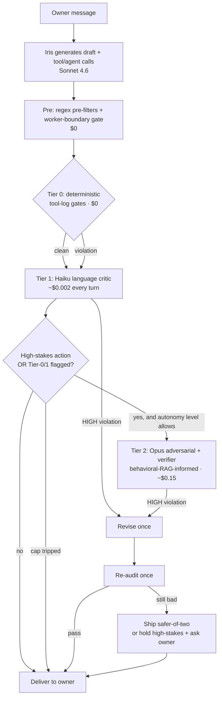
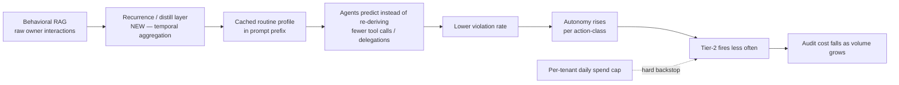
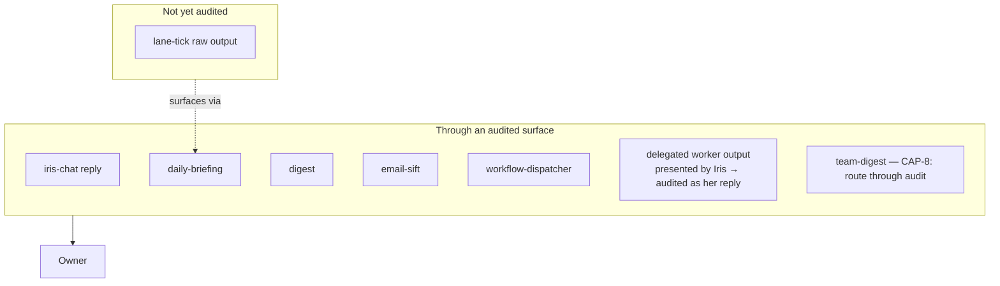

# Architecture Diagrams

## Per-turn audit flow

Bounded: at most draft + one revision. No critique↔revise recursion.

## Cost-via-learning loop (the curve-bender over time)

## Audit surface coverage (target)

